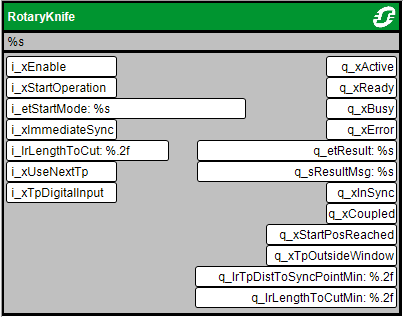
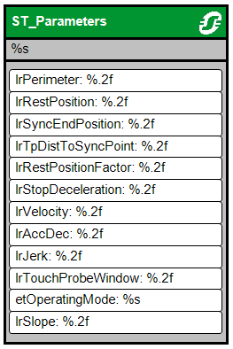

# Visualization

## Overview

Visualization screens are embedded in the MotionApplicationFunctionBlocks library to configure and start the function block.

Inputs and outputs as well as ST\_Parameters are accessible.

EIO0000004585.05