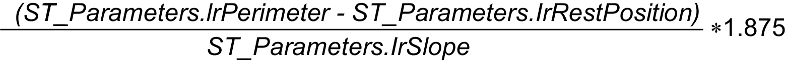
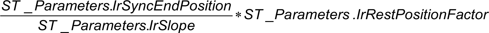
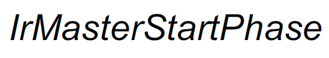

# Calculations

## Master Start Phase

The movement from the rest position to the start point of the synchronous phase is calculated as follows (in units defined for the master axis).

For FlyingShear:

For RotaryKnife:

## Master Stop Phase

The movement from the start point of the synchronous phase to the rest position is calculated as follows (in units defined for the master axis):

## Minimum Distance Between Touch Probe and Synchronous Point (q\_lrTpDistToSyncPointMin)

The output q\_lrTpDistToSyncPointMin that defines the minimum distance between the touch probe sensor and the start point of the synchronous phase depends on the operating mode.

Operating mode ContinuousWithCorrection:

Operating mode CutOnTouchProbe:

## Minimum Value for Length to Cut (q\_lrLengthToCutMin)

The minimum value for the length to cut (q\_lrLengthToCutMin) is calculated as follows, depending on the operating mode:

Operating mode Continuous:

Operating mode ContinuousWithCorrection:

Operating mode CutOnTouchProbe:

Where:

## Minimum Value for Touch Probe Window

The minimum value for the touch probe window depends on the operating mode.

In operating mode ContinuousWithCorrection, the value must be greater than 0.

In operating mode CutOnTouchProbe, the value is equal to the maximum value of lrMasterStartPhase and lrLengthToCutMin.

EIO0000004585.05