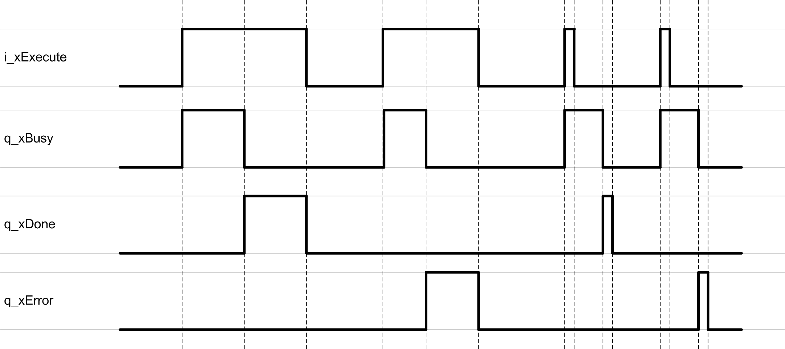

# Behavior of Function Blocks with the Input i\_xExecute

## General Information

A rising edge of the input i\_xExecute starts the execution of the function block. The function block continues execution and the output q\_xBusy is set to TRUE. Additional rising edges at the input i\_xExecute are ignored while the function block is being executed.

Once the execution is finished, the outputs q\_xDone or q\_xError remain TRUE until the input i\_xExecute is set to FALSE. If the input is reset before the execution is finished, the function block continues to execute until it has finished its processing, and then the outputs q\_xDone or q\_xError are set to TRUE for one cycle.

## Example

EIO0000005567.02