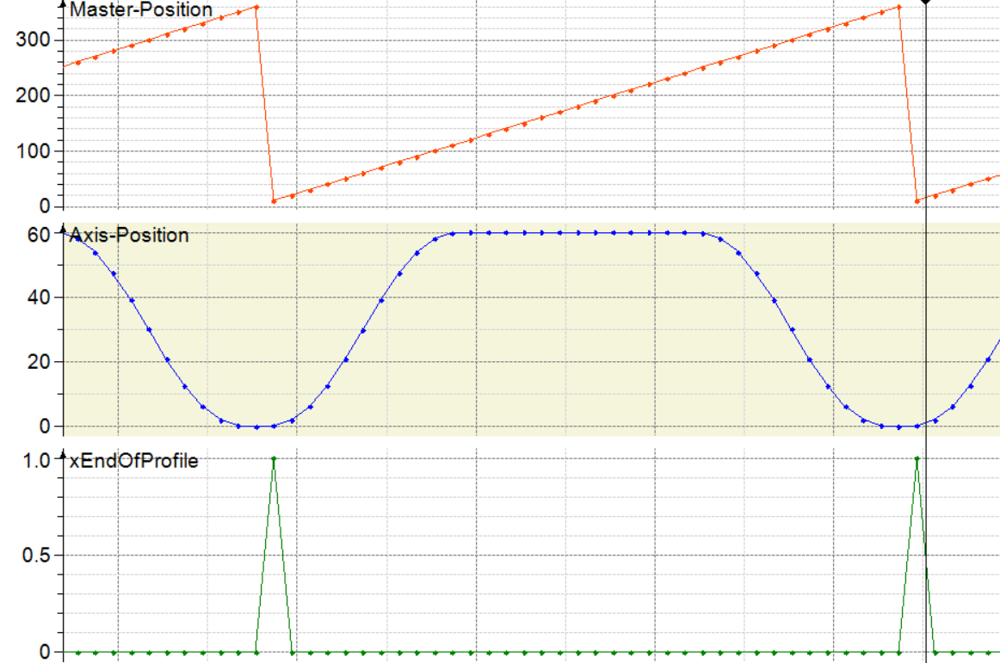
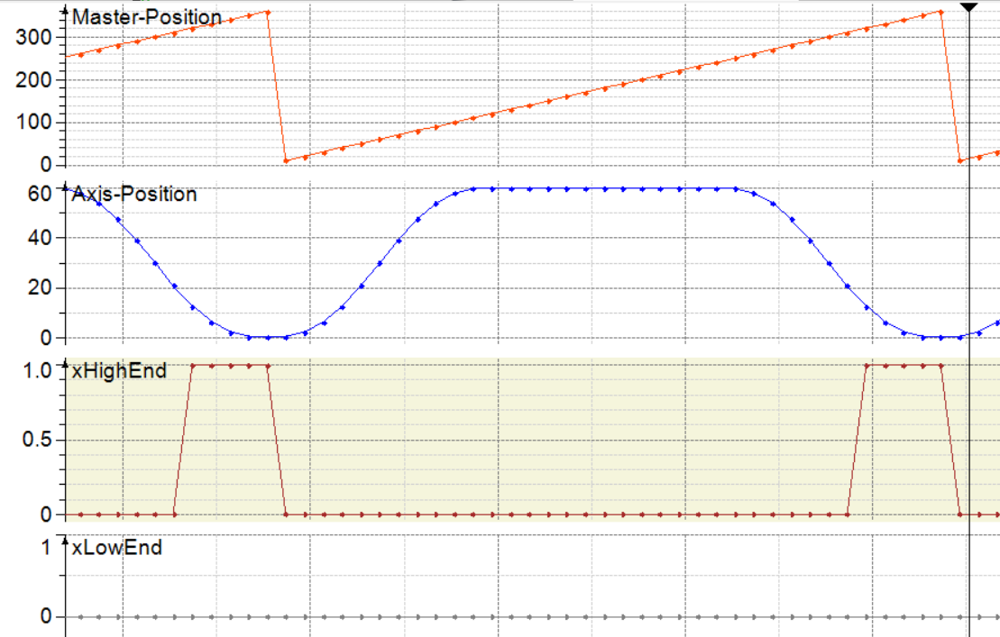

# ST\_CamInfo

## Overview

|  |  |
| --- | --- |
| Type: | Structure |
| Available as of: | V1.0.1.0 |
| Inherits from: | — |

## Description

The structure ST\_CamInfo specifies the cam profile.

## Structure Elements

| Name | Data Type | Description |
| --- | --- | --- |
| xEndOfProfile | BOOL | Value range: FALSE, TRUE  Default: FALSE   * FALSE: The last segment of the cam has not been completed * TRUE: The last segment of the cam has been completed.   Refer to [xEndOfProfile](#ST_CamInfo-419DE7B9__XEndOfProfile-75A6F659). |
| xHighEnd | BOOL | Refer to [xHighEnd](#ST_CamInfo-419DE7B9__XHighEnd-75A6F818). |
| xLowEnd | BOOL | Refer to [xLowEnd](#ST_CamInfo-419DE7B9__XLowEnd-75A6FAB0). |
| timRampInDuration | TIME | Indicates the time remaining until the ramp-in procedure is completed. |

## xEndOfProfile

## xHighEnd

* The signal is TRUE before end of profile, when the master is moving in positive direction.
* Depending on the value set via the method SetNoOfCyclesBeforeXEnd.

## xLowEnd

* The signal is TRUE before end of profile, when the master is moving in negative direction.
* Depending on the value set via the method SetNoOfCyclesBeforeXEnd.

EIO0000005567.02