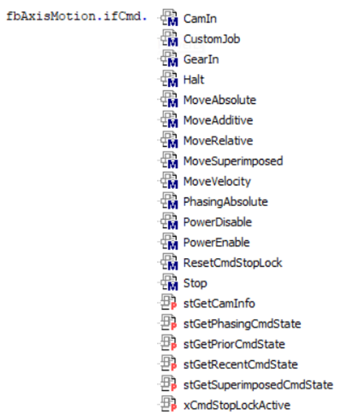

# FB\_AxisMotion - General Information

## Overview

|  |  |
| --- | --- |
| Type: | Function block |
| Available as of: | V1.0.1.0 |
| Inherits from: | – |

## Task

The function block combines the various PLCopen functionalities within one function block to help improve the scalability in an application.

## Description

The purpose of the function block FB\_AxisMotion is to provide the PLCopen functionalities in one function block.



The function block FB\_AxisMotion enables the axis motion as well as the scalability of the application for multiple axes.

NOTE:

* The function blocks from the PLCopen library can be used in parallel with FB\_AxisMotion. For each functionality a dedicated function block is provided.
* The POU must not be called.
* The function block can be used by calling a method or a property. Use the same task for calling the methods.
* In case of using multi task or multi core, ensure that the call of a method will not be interrupted from another call in another task.

Example for instantiating one function block while calling only the provided method Cycle of this function block.

Instantiating:

```
   PROGRAM SR_MainPLCO_AxMotion  
   VAR  
      //Ax-FB's  
      fbAxisMotionMaster : AMO.FB_AxisMotion;  
      fbAxisMotionSlave : AMO.FB_AxisMotion;
```

Calling:

```
      fbAxisMotionSlave.Cycle(  
            q_etResult      => etResultSlave,  
            q_sResultMsg    => sResultMsgSlave,  
            q_xError        => xErrorSlave);  
  
      fbAxisMotionMaster.Cycle(  
            q_etResult      => etResultMaster,  
            q_sResultMsg    => sResultMaster,  
            q_xError        => xErrorMaster);
```

## ApplicationLogger - Logger Point

The function block implements a logger point that can be registered with the global Application Logger. When registered, the function block generates logger entries on following events.

| Event | Log level |
| --- | --- |
| Any command successfully started | UserAction |
| Any command failed | Exception |
| Any configuration failed | Exception |

With the method [Register](IF_LoggerPointConfigurationRegister-4599E66B.html), the function block FB\_AxisMotion is registered as a logger point in the global Application Logger. The values for the LoggerPoint parameters type and source are set to FB\_AxisMotion and MFB, respectively. For more information refer to the ApplicationLogger Library Guide.

## Methods

| Name | Description |
| --- | --- |
| [FB\_AxisMotion.Cycle](FB_AxisMotion-CycleMethod-4214BB33.html#FB_AxisMotion-CycleMethod-4214BB33) | Map error from an executed command on the output. |
| [FB\_AxisMotion.Init](FB_AxisMotion-InitMethod-429752A8.html#FB_AxisMotion-InitMethod-429752A8) | Assign the axis which is used for the move-commands and assign LoggerPoint for ApplicationLogger entries. |

## Properties

| Name | Task | Accessing | Description |
| --- | --- | --- | --- |
| ifAdminstrative | Get access to the methods of  IF\_Adminstrative to execute administrative tasks.  Refer to  [IF\_Adminstrative](IF_AdministrativeGeneralInformation-42AE9496.html). | Get | The property ifAdminstrative  enables access to administrative tasks. |
| ifCmd | Get access to the methods of IF\_ Cmd to execute motion commands and get their feedback.  Refer to [IF\_Cmd](IF_CmdGeneralInformation-44AB82A7.html). | Get | The property ifCmd is used to move the axis and get feedback from the commands. |
| ifConfiguration | Get access to the methods of IF\_Configuration to configure the axis .  Refer to [IF\_Configuration](IF_ConfigurationGeneralInformation-43280962.html). | Get | The property ifConfiguration is used to configure the axis.  NOTE: In PLCopen, there are Read commands for getting information about the commanded axis. |
| ifGetAxisInfo | Get status information on the axis.  Refer to [IF\_AxisInfo](IF_AxisInfoGeneralInformation-431DFDD5.html). | Get | The property ifGetAxisInfo is used to get status information on the axis. |
| ifGetAxisState | Reads the active status of the axis IF\_AxisState.  Refer to [IF\_AxisState](IF_AxisStateGeneralInformation-432183F6.html). | Get | The property ifGetAxisState  is used to get active status on the axis. |
| ifGetMotionState | Provide status information on the ongoing movement.  Refer to [IF\_MotionState](IF_MotionStateGeneralInformation-43244381.html). | Get | The property ifGetMotionState  is used to get the status information on the ongoing movement. |
| ifGetMotionValues | IF\_ MotionState provides the motion values of an axis.  Refer to [IF\_ MotionValues](IF_MotionValuesGeneralInformation-432687E3.html). | Get | The property ifGetMotionValues is used to get the motion values of an axis. |
| ifLoggerPoint | Get access to the LoggerPoint configuration.  Refer to [IF\_LoggerPointConfiguration](IF_LoggerPointConfigurationGeneralI-4594100E.html). | Get | The property ifLoggerPoint  is used to get access to the LoggerPoint configuration. |

EIO0000005567.02