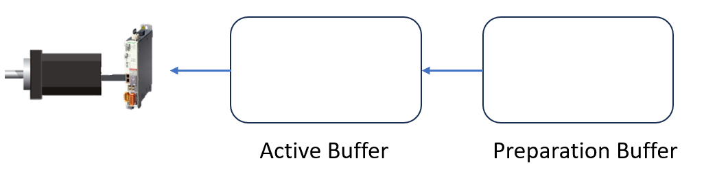
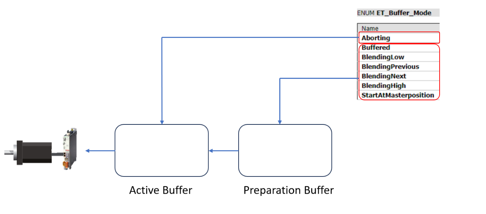

# Handling Active Buffer and Preparation Buffer

## Overview

OneMotionKernel provides two job buffers to process the move commands for an axis:

* Active buffer
* Preparation buffer

Depending on the buffer mode, the move command is loaded in the appropriate buffer.

If the buffer mode is aborting, it is set as an active job in the active buffer and interrupts an active job.

If the buffer mode is one of the buffered modes, it is loaded into the preparation buffer and automatically loaded into the active buffer as soon as the job in the active buffer is finished.

EIO0000005567.02