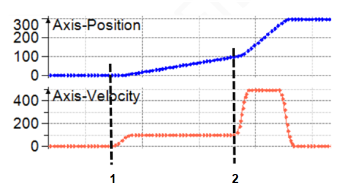
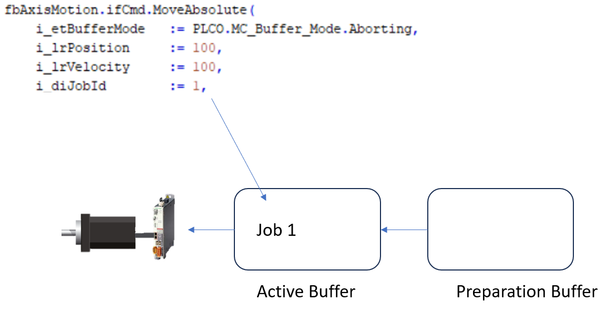
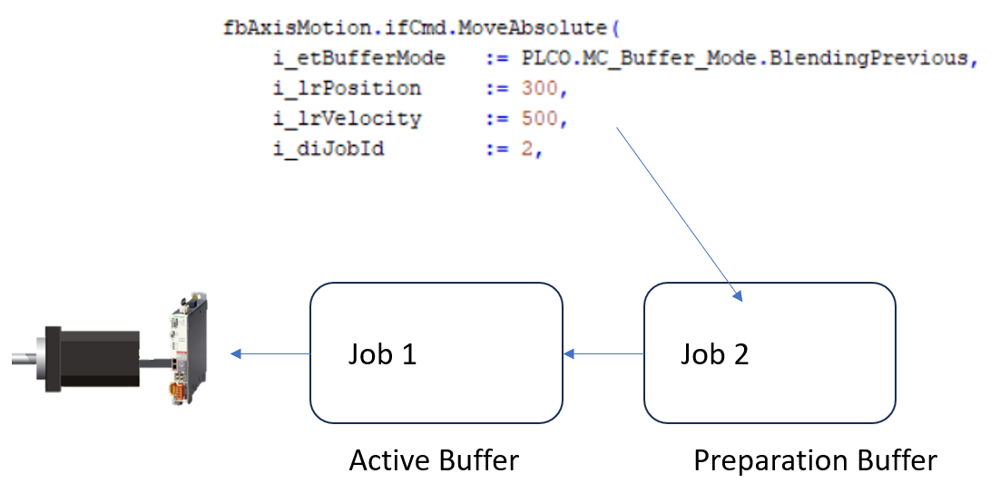
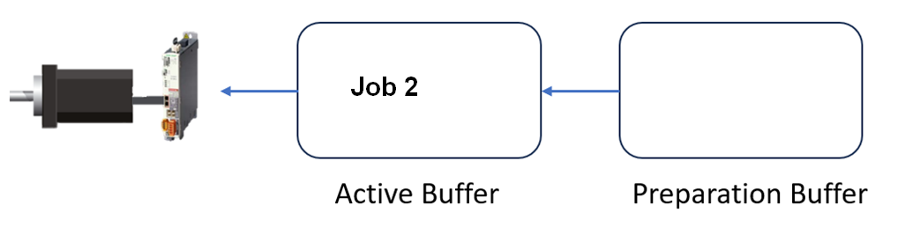
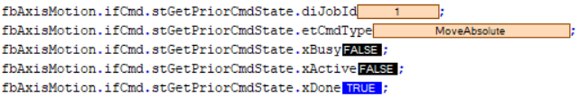
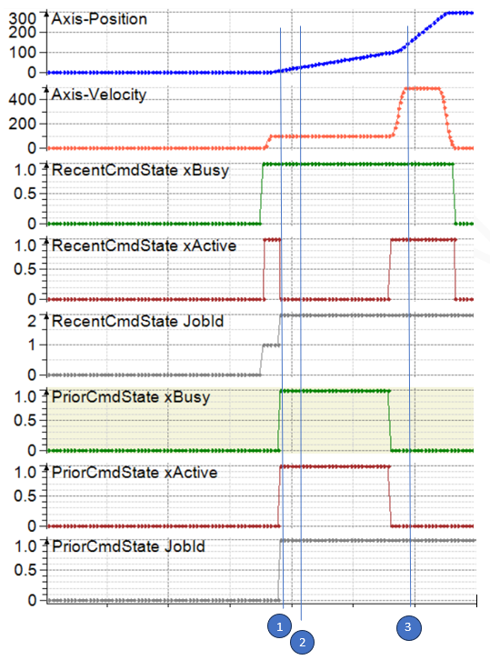

# Calling a Command and Evaluating its Feedback

## Description

The function block FB\_AxisMotion has two properties, stGetRecentCmdState and stGetPriorCmdState, to show which command is running in the active buffer or preparation buffer and the states of these commands. The use case shows the interaction of the properties and the buffer.

Start a positioning with a velocity of 100 m/s to target position 100. When the position has been reached, start a second positioning to target position 300 with a velocity of 500 m/s and without a stop in between.

**1** Execute the first job.

**2** Execute the second job, when the target position of the first job has been reached.

## First Step of Implementing a Use Case

Load the first command MoveAbsolute with buffer mode `Aborting` and `JobId=1` in the active buffer:

The command is mapped in the property stGetRecentCmdState because it is the command which has been newly set:

|  |  |
| --- | --- |
|  |  |

## Second Step of Implementing a Use Case

A second command `MoveAbsolute` with buffer mode `BlendingPrevious` and `JobId=2`  is loaded in the preparation buffer.

The command is mapped in the property stGetRecentCmdState because it is the command that has been newly set, and the previous command is shifted in the property stGetPriorCmdState.

|  |  |
| --- | --- |
|  |  |

## Monitoring the Buffer via Variables and Traces

When the first job has been completed, the second job is loaded from the preparation buffer into the active buffer.

In the feedback structure `stGetPriorCmdState` , `xDone = TRUE` indicates that the job is finished.

The following traces show the behavior:

**1** Load first move command MoveAbsolute with `JobId=1`. It is mapped in stGetRecentCmdState.

**2** Load second move command MoveAbsolute with `JobId=2`. The previous command is shifted from stGetRecentCmdState to stPriorCmdState, and the new command is loadedJob in stGetRecentCmdState. The state-signals of the second MoveAbsolute are then available.

**3** When the first move command is executed, the second command becomes active.

EIO0000005567.02