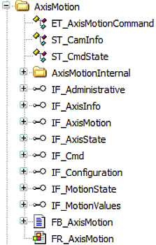

# Visualization for FB\_AxisMotion

## Description

The MotionFunctionBlocks library provides a visualization for FB\_AxisMotion that enables you to test and execute the methods. Besides, the relevant feedback signals are displayed.



## Using the Visualization

| Step | Action | |
| --- | --- | --- |
| 1 | Instantiate the FB\_AxisMotion function block:  ``` PROGRAM SR_Main VAR     fbDriveMotion  :  MFB.FB_Axismotion; ``` | |
| 2 | Call the method Init once.  ``` IF xInit THEN    xInit := FALSE;    fbDrivelMotion. Init(       i_ifAxis                := DRV_Drivel.Axis,        i_ifParentLoggerpoint   := APL2.G_ifApplicationLogger,       i_sLoggerPointName      := 'DRV_Drivel'); END_IF ``` | |
| 3 | Call the method Cycle cyclically:  ``` fbDrivelMotion.Cycle(    q_etResult    => etResultDrivel,    q_sResultMsg  => sResultDrivel,    q_xError      => xErrorDrivel); ``` | |
| 4 | Add frame FR\_AxisMotion in the visualization.  Reference your instance to the visualization frame: | |
| 5 | The provided methods in the different interfaces are accessible.  The following example shows the method MoveVelocity from the interface IF\_Cmd: | |
|  |  |

## Assign the Master Axis and Cam Tables

It is necessary to initialize a master-axis and cam profiles in order to be able to use the methods CamIn and GearIn from the interface IF\_Cmd. For this purpose, a method Init\_VisForCamInAndGearIn is provided in order to assign the master-axis and the cam tables.

The method must be called once in your program:

```
fbDrivelMotion. Init_VisuForCamInAndGearIn(
   i_ifMasterAxis := DRV_Master.Axis,
   iq_astCamTable := astCamTable);
```

EIO0000005567.02