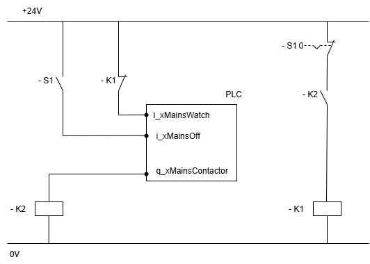

# FB\_MainsContactor – General Information

## Overview

|  |  |
| --- | --- |
| Type: | Function block |
| Available as of: | 1.2.0.0 |
| Inherits from: | – |

## Task

Supports the control and monitoring of a mains contactor in the system.

## Description

This function block can be used to monitor and control the mains contactor in your system. In addition, it offers additional inputs that can be used for alarm handling in your application. This alarm handling includes the control of various signals that can be used to control synchronized axes.

For a detailed description of the stages reached during the execution of this function block, such as initializing and mains contactor control, see [Stages during Execution of the Function Block](FB_MainsContactorStagesDuringExecut-DC0B39E4.html).

## Interface

| Input | Data type | Description |
| --- | --- | --- |
| i\_xEnable | BOOL | A rising edge of this input enables the function block.  For more information refer to [Behavior of Function Blocks with the Input i\_xEnable](i_xEnable-145A050A.html). |
| i\_xMainsWatch | BOOL | The feedback signal from mains contactor - NC (Normally Closed) contact.  TRUE: Mains contactor is de-energized.  FALSE: Mains contactor is energized. |
| i\_xMainsOff | BOOL | Linked to an external condition that indicates whether the mains contactor is ready to be energized.  TRUE: Mains contactor is not ready to be energized.  FALSE: Mains contactor is ready to be energized by the function block. |
| i\_timPowerOnDelay | TIME | Delay time after which the function block activates the output signals for controlling the axes. The feedback signal of the mains contactor must be switched to FALSE within this time.   * Default value T = 1 s * Minimum value T = 1 s |
| i\_xAlarmClass1 | BOOL | Triggers alarm level 10 |
| i\_xAlarmClass2 | BOOL | Triggers alarm level 20 |
| i\_xAlarmClass3 | BOOL | Triggers alarm level 30 |
| i\_lrMasterVel | LREAL | Velocity of the master axis. Relevant for alarm level 20 and alarm level 30. |
| i\_timMasterStop | TIME | Required time for the master axis to be stopped while i\_xAlarmClass2 is TRUE.  After this time, the output q\_xSlaveStop is set to TRUE, and q\_xAxisEnable is set to FALSE, regardless of the value at i\_lrMasterVel. |
| i\_xAlarmQuit | BOOL | Upon a rising edge the alarm conditions are verified and an alarm state is reset. |

| Output | Data type | Description |
| --- | --- | --- |
| q\_xActive | BOOL | If the function block is active, this output is set to TRUE. |
| q\_xReady | BOOL | If the initialization is successful, this output is set to TRUE. |
| q\_xError | BOOL | The output is set to TRUE if an error has been detected during the execution. |
| q\_etResult | ET\_Result | POU-specific output on the diagnostic; q\_xError = FALSE -> Status message; q\_xError = TRUE -> Diagnostic message. |
| q\_sResultMsg | STRING[80] | Event-triggered message that gives additional information on the diagnostic state. |
| q\_diAlarmLevel | DINT | Present alarm level.  The following output values are set:   * 10: alarm class 1 is active * 20: alarm class 2 is active * 30: alarm class 3 is active |
| q\_xAxisEnable | BOOL | Output is used as command to enable the power stages of the monitored axes. |
| q\_xAlarm | BOOL | Indicate presence of alarm. |
| q\_xMasterStop | BOOL | Output is used as a command to initiate the master axis stop. |
| q\_xMasterQStop | BOOL | Output is used as a command to initiate the master axis quick stop. |
| q\_xSlaveStop | BOOL | Output is used as a command to initiate the secondary axis stop. |
| q\_xMainsContactor | BOOL | Output is used to control the mains contactor.  TRUE: Energizing the mains contactor.  FALSE: De-energizing the mains contactor. |

## Troubleshooting

This table describes the possible issues and their solutions:

| Issue  (alarm information q\_xAlarm = TRUE) | Cause | Solution |
| --- | --- | --- |
| q\_etResult = MainsOffAlarm | Missing condition for the mains contactor to be energized (i\_xMainsOff = TRUE). | Resolve issue related to the condition for energizing the mains contactor and reset alarm with i\_xAlarmQuit setting to TRUE. |
| q\_etResult = MainsWatchException | Invalid feedback from the mains contactor. The mains contactor is not energizing after defined time for energizing.   * No feedback while the mains contactor is energized. * The mains contactor was already energized when the function block was enabled. | Resolve issue related to feedback from mains contactor and reset alarm with i\_xAlarmQuit setting to TRUE. |
| q\_etResult = AlarmClass1 | Alarm class 1 triggered (i\_xAlarmClass1 = TRUE) | Resolve issue related to alarm class 1 and reset alarm with i\_xAlarmQuit  setting to TRUE. |
| q\_etResult = AlarmClass2 | Alarm class 2 triggered (i\_xAlarmClass2 = TRUE) | Resolve issue related to alarm class 2 and reset alarm with i\_xAlarmQuit  setting to TRUE. |
| q\_etResult = AlarmClass3 | Alarm class 3 triggered (i\_xAlarmClass3 = TRUE) | Resolve issue related to alarm class 3 and reset alarm with i\_xAlarmQuit  setting to TRUE. |

## Wiring Example

Simplified circuit diagram to present the wiring of the signals relevant to the function block:

* The auxiliary relay -K2 switches the mains contactor -K1.
* The auxiliary relay -K2 is wired and controlled by the output q\_xMainsContactor.
* Feedback from the mains contactor -K1 and from emergency stop button -S1 is wired to the controller inputs i\_xMainsWatch and i\_xMainsOff.
* In this wiring example, -S1 is presented as an emergency stop but it in general it presents any external condition where the mains contactor cannot be energized.

EIO0000005567.02