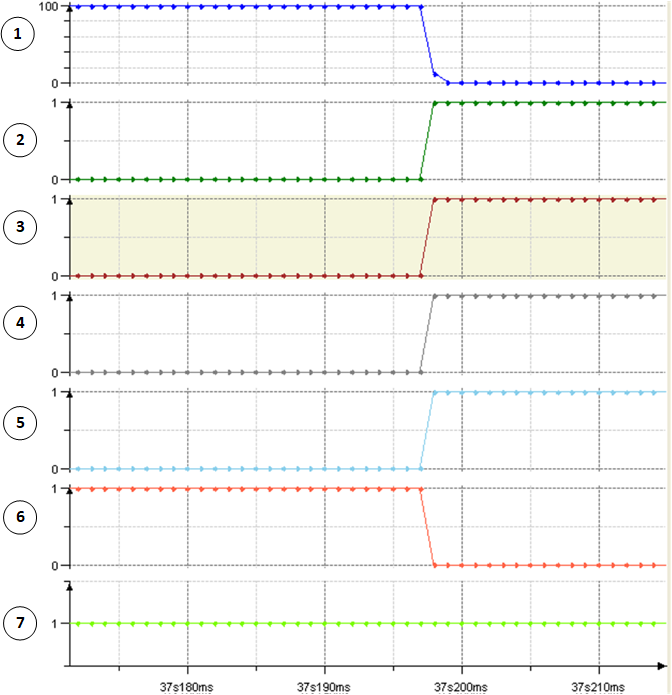
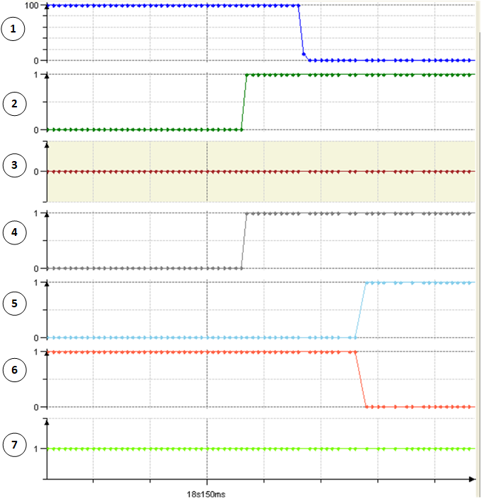
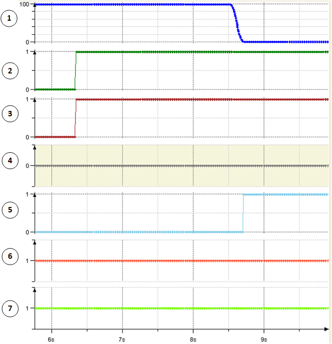

# Stages during Execution of the Function Block

## Overview

The following stages are reached during the execution of the function block:

* [Initialization](#FB_MainsContactorStagesDuringExecut-DC0B39E4__Initialization-D2C9B7D1)
* [Mains contactor control](#FB_MainsContactorStagesDuringExecut-DC0B39E4__MainsContactorControl-D2D11BE2)
* Alarm class monitoring:

  + [Alarm class 1 behavior](#FB_MainsContactorStagesDuringExecut-DC0B39E4__AlarmClass1Behavior-D3416C92)
  + [Alarm class 2 behavior](#FB_MainsContactorStagesDuringExecut-DC0B39E4__AlarmClass2Behavior-D3436A1D)
  + [Alarm class 3 behavior](#FB_MainsContactorStagesDuringExecut-DC0B39E4__AlarmClass3Behavior-D6E39EB5)
  + [Alarm acknowledgment](#FB_MainsContactorStagesDuringExecut-DC0B39E4__QuittingAnAlarm-D344D7AE)

## Initialization

Upon a rising edge i\_xEnable, the initialization of the function block is started.

* The input i\_xMainsoff is expected to be FALSE.
* The input i\_xMainsWatch is expected to be TRUE.
* The output q\_xMainsContactor is energized.
* The input i\_xMainsWatch becomes FALSE within the time specified via input i\_timPowerOnDelay.
* After the time i\_timPowerOnDelay is elapsed, the outputs for controlling the axes are updated and the monitoring of the alarm inputs is active.

## Mains Contactor Control

The output q\_xMainsContactor  is de-energized under the following conditions:

* The function block is disabled.
* The input i\_xMainsWatch is detected as TRUE.
* The input i\_xMainsOff is detected as TRUE.

## Alarm Class 1 Behavior

Upon a rising edge on input i\_xAlarmClass1, the AlarmClass1 alarm is active. The axis are stopped asynchronously.

* The output q\_xAxisEnabled  is set to FALSE.
* The outputs q\_xMasterStop, q\_xMasterQStop and q\_xSlaveStop are set to TRUE.

**1** i\_lrMasterVel

**2** i\_xAlarmClass1

**3** q\_xMasterStop

**4** q\_xMasterQStop

**5** q\_xSlaveStop

**6** q\_xAxisEnable

**7** q\_xMainsContactor

## Alarm Class 2 Behavior

Upon a rising edge on input i\_xAlarmClass2, the AlarmClass2 alarm is active. The master axis is stopped immediately, and the secondary axes are stopped synchronously with the master axis.

* The output q\_xMasterQStop is set to TRUE.
* Master standstill is detected by time i\_timMasterStop or by speed i\_lrMasterVel.
* Upon detecting master standstill output q\_xSlaveStop  is set to TRUE.
* Upon detecting master standstill output q\_xAxisEnable is set to FALSE.

NOTE: Higher alarm class, feedback from contactor or conditions for energizing the mains contactor are prioritized during the execution of this alarm class.

**1** i\_lrMasterVel

**2** i\_xAlarmClass2

**3** q\_xMasterStop

**4** q\_xMasterQStop

**5** q\_xSlaveStop

**6** q\_xAxisEnable

**7** q\_xMainsContactor

## Alarm Class 3 Behavior

Upon a rising edge on input i\_xAlarmClass3, the AlarmClass3 alarm is active. The master axis is stopped at the end of the cycle, the secondary axes are stopped synchronously with the master axis.

* The output q\_xMasterStop is set to TRUE.
* Master standstill is detected by time i\_timMasterStop or by the actual speed i\_lrMasterVel.
* Upon detecting master standstill output, q\_xSlaveStop is set to TRUE.

NOTE: Higher alarm class, feedback from contactor or conditions for energizing the mains contactor are prioritized during the execution of this alarm class.

**1** i\_lrMasterVel

**2** i\_xAlarmClass3

**3** q\_xMasterStop

**4** q\_xMasterQStop

**5** q\_xSlaveStop

**6** q\_xAxisEnable

**7** q\_xMainsContactor

## Alarm Acknowledgement

Every detected alarm must be acknowledged by the input i\_xAlarmQuit. An alarm is reset only if the alarm condition is not active anymore. Upon acknowledging an alarm MainsWatch or MainsOff, the function block starts with the initializing sequence. After an AlarmClass1, AlarmClass2 or AlarmClass3 alarm, the function block continues in alarm monitoring without switching the mains contactor.

EIO0000005567.02