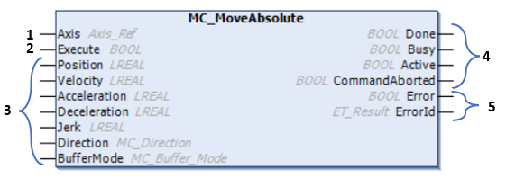
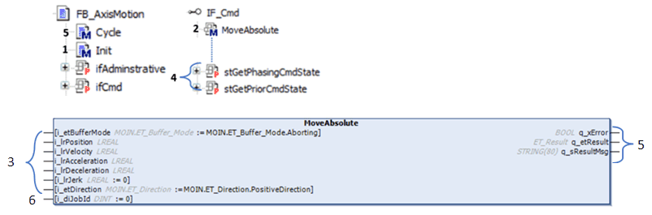

# IF\_Cmd – General Information

## Overview

|  |  |
| --- | --- |
| Type: | Interface |
| Available as of: | V1.0.1.0 |
| Inherits from: | — |

## Description

The commands are implemented according to the behavior ofPLCopen standard. This means that the behavior of the selected buffer mode and the behavior of the outputs of the commands from the function block FB\_AxisMotion are the same as the commands from the function blocks from the PLCopen library

There are only a few differences in how to use and how to get the feedbacks. The difference is described with the command MoveAbsolute.

PLCopen library MoveAbsolute:

FB\_AxisMotion - MoveAbsolute:

| Nb | PLCopen lib | FB\_AxisMotion |
| --- | --- | --- |
| 1 | The axis is assigned using an input. | The axis is assigned for all methods using the method Init. |
| 2 | The movecommand is executed with the rising edge of the input Execute. | The movecommand is executed by calling the method MoveAbsolute. |
| 3 | Motion parameter for moving absolute to a position is available. | Motion parameter for moving absolute to a position is available. |
| 4 | The feedbacks of the commands are available on the outputs from the function block. | The properties stGetPriorCmdState and stGetRecentCmdState provide the feedbacks of the command. |
| 5 | Errors are indicated by the outputs. | Errors which occur when calling the methods, for example incorrect velocity parameters, are indicated by the output of the method of the command and at the outputs of the cycle method.  Errors which occur when executing are indicated in the properties stGetPriorCmdState and stGetRecentCmdState and at the output of the cycle method. |
| 6 | It is not possible to set a JobId for the command. | Provides a JobId for each movecommand. The JobId is available in the feedback properties stGetRecentCmdState and stGetPriorCmdState. |

## Methods

| Name | Description |
| --- | --- |
| [Camin](IF_CmdCaminMethod-451E7AED.html) | Activates master-subordinate coupling with a cam-profile. |
| [CustomJob](IF_CmdCustomJobMethod-452B6E12.html) | Controls an axis by a user-defined algorithm that calculates cyclic set position, velocity, and acceleration of the axis. |
| [GearIn](IF_CmdGearInMethod-453609FB.html) | Activates coupling of a master axis and a subordinate axis with a given gear factor. |
| [Halt](IF_CmdHaltMethod-4538EDB4.html) | Stops an ongoing movement. |
| [MoveAbsolute](IF_CmdMoveAbsoluteMethod-45AAC37B.html) | Performs a movement to a specified absolute target position. |
| [MoveRelative](IF_CmdMoveAdditiveMethod-45AE4F0E.html) | Performs a movement with a specified distance with reference to the position. |
| [MoveAdditive](IF_CmdMoveAdditiveMethod-45AE4F0E.html) | Performs a movement with a specified distance with reference to the previous target position. |
| [MoveSuperImposed](IF_CmdMoveSuperImposedMethod-45B002BA.html) | Performs a superimposed movement with a specified position offset with reference to the position of an ongoing movement. |
| [MoveVelocity](IF_CmdMoveVelocityMethod-45B0D0BD.html) | Performs a movement with a specified target velocity. |
| [PhasingAbsolute](IF_CmdPhasingAbsoluteMethod-45B36219.html) | Creates a position offset between the position of a master axis and the position of the master axis as it is seen by the subordinate axis. |
| [PowerDisable](IF_CmdPowerDisableMethod-45B56E83.html) | Creates a position offset between the position of a master axis and the position of this master axis as it is seen by the subordinate axis. |
| [PowerEnable](IF_CmdPowerEnableMethod-45B625A9.html) | Creates a position offset between the position of a master axis and the position of this master axis as it is seen by the subordinate axis. |
| [ResetCmdStopLock](IF_CmdResetCmdStopLockMethod-45B74625.html#IF_CmdResetCmdStopLockMethod-45B74625) | Resets the lock from a stop command to allow for new commands. |
| [Stop](IF_CmdStopMethod-45B971DD.html) | Stops the ongoing movement. |
| [Jog](IF_CmdJogMethod-D252F1AF.html) | Performs jog movement. |

## Properties

| Name | Data type | Accessing | Description |
| --- | --- | --- | --- |
| lrGetPhasingAbsoluteShift | LREAL | Get | Feedback of the phase shift. |
| lrGetSuperimposedCoveredDistance | LREAL | Get | Feedback of the covered distance. |
| stGetCamInfo | REFERENCE TO ST\_CamInfo | Get | Read information about the cam profile. |
| stGetPhasingCmdState | REFERENCE TO ST\_CmdState | Get | Read information about the phasing command. |
| stGetPriorCmdState | REFERENCE TO ST\_CmdState | Get | Read information about the prior command. |
| stGetRecentCmdState | REFERENCE TO ST\_CmdState | Get | Read information about the superimposed command. |
| stGetSuperimposedCmdState | REFERENCE TO ST\_CmdState | Get | Read information about the superimposed command. |
| xCmdStopLockActive | BOOL (Get) | Get | Get the information whether the lock of new commands is active. |
| xJogForward | BOOL (Get) | Get | Performs a jog movement in positive direction.  If xJogForward is TRUE and xJogBackward is FALSE, the movement in positive direction is started. |
| xJogBackward | BOOL (Get) | Get | Performs a jog movement in negative direction.  If xJogBackward is TRUE and xJogForward is FALSE, the movement in negative direction is started. |

EIO0000005567.02