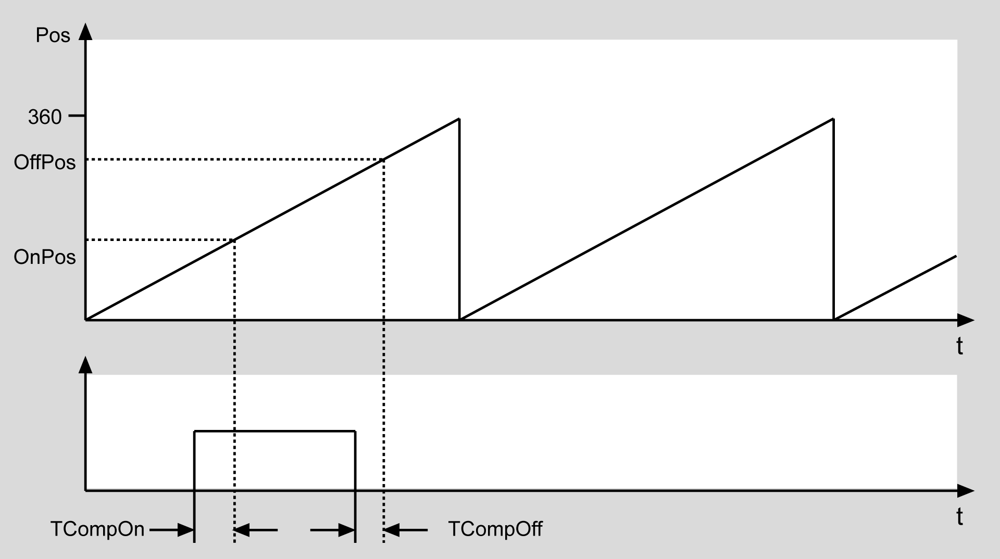
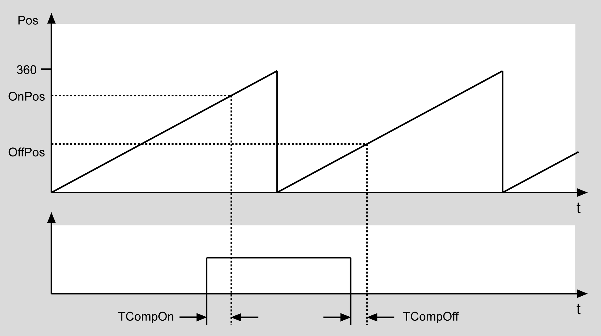

# FC\_CamTappetSwitch

## Overview

|  |  |
| --- | --- |
| Type: | Function |
| Available as of: | V1.0.1.0 |
| Version: | Installed version |

## Task

Monitor the position value of a motion object to control an output.

## Description

Issues the function value TRUE as long as the position i\_lrEncoderPos is between the activation point i\_lrOnPos and the deactivation point i\_lrOffPos. A dead time can be entered. That is, the function value is set to TRUE by i\_uiTCompOn earlier than i\_lrOnPos, and then set to FALSE again by i\_uiTCompOff earlier than i\_lrOffPos.

OnPos < OffPos

OnPos > OffPos

## Interface

NOTE: For continuous operation, the POU needs to be called cyclically with the active input values.

| Input | Data type | Description |
| --- | --- | --- |
| i\_IrEncoderPos | LREAL | Position of the master encoder |
| i\_IrEncoderVel | LREAL | Velocity of the master encoder |
| i\_IrPeriod | LREAL | Master encoder period |
| i\_IrOnPos | LREAL | Activation position |
| i\_uiTCompOn | UINT | Compensation time during activation in ms |
| i\_IrOffPos | LREAL | Deactivation position |
| i\_uiTCompOff | UINT | Compensation time during deactivation in ms |

| Output | Data type | Description |
| --- | --- | --- |
| q\_xError | BOOL | The output is set to TRUE if an error has been detected during the execution. |
| q\_etResult | ET\_Result | POU-specific output on the diagnostic; q\_xError = FALSE -> Status message; q\_xError = TRUE -> Diagnostic message. |
| q\_sResultMsg | STRING[80] | Event-triggered message that gives additional information on the diagnostic state. |

## Return Value

| Data type | Description |
| --- | --- |
| BOOL | Cam position set |

## Troubleshooting

This table describes the possible issues and their solutions:

| Issue  (error information q\_xError = TRUE) | Cause | Solution |
| --- | --- | --- |
| q\_etResult = InvalidInput | i\_IrPeriod is less or equal to 0. | i\_IrPeriod must be greater than 0. |

EIO0000005567.02