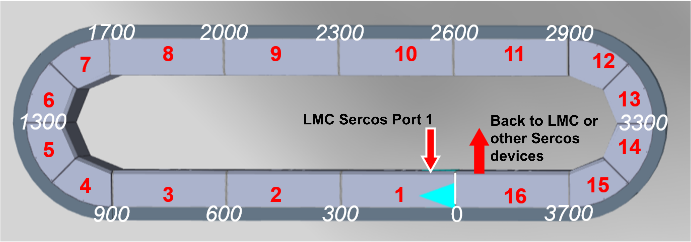
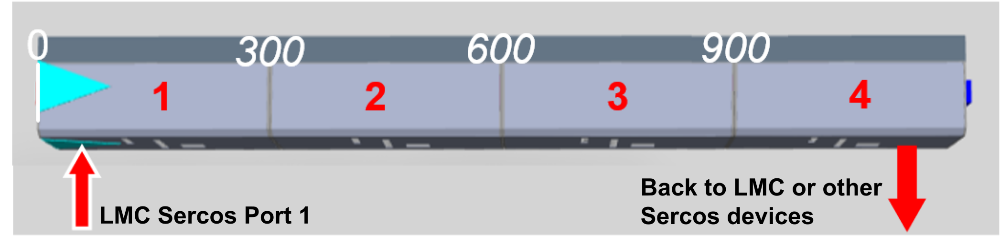
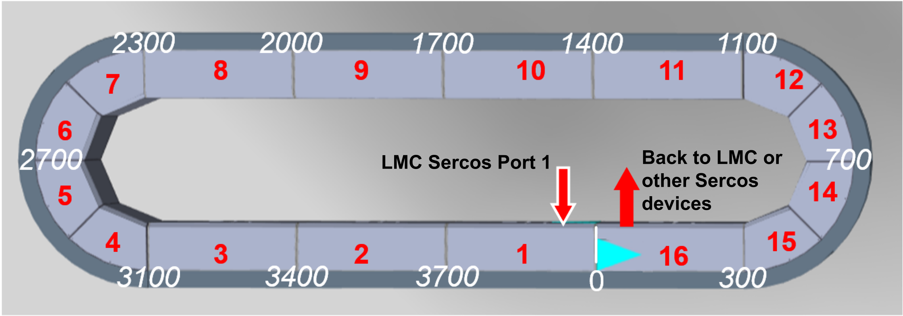
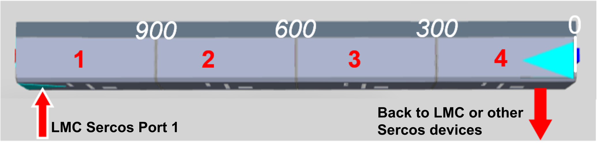

# Linear Coordinate System and Working Direction of the Track

## Linear Coordinate System

The movements of the carriers in a Lexium™ MC multi carrier transport system are referenced to a linear coordinate system. The origin of the linear coordinate system is related to the Sercos infeed of the track: the connection of the LMC Sercos port to a segment is what establishes Segment 1. Segment 1 must be connected to LMC PacDrive Sercos port 1 (CN12). For more information on the electrical connection to the controller, refer to the  [LMC Pro/Pro2 Hardware Guide](../../../../../api/crossBook?lang=en-US&virtualBookName=LMC300HW&topicID=D_SE_0051351).

* In a closed track, the origin of the coordinate system is defined as the segment border of the two adjacent segments with Sercos infeed and outfeed.
* In an open track, the origin of the coordinate system is defined as the segment border of the first or last segment (see also [Working Direction](#IntroMC_CoordSys-0FC9FA31__WorkingDirection-0FC9F3F6)).

For more information on the cartesian coordinate system of a Lexium™ MC multi carrier track, refer to the description of the [Cartesian Coordinate System of the Track](IntroMC_Cartesian-CB2A38A0.html#IntroMC_Cartesian-CB2A38A0).

Closed Track in Default Working Direction 

NOTE: The blue arrow indicates the forward moving direction, the red numbers indicate the topological addresses of the segments and the white numbers indicate the positions (in mm) in the linear coordinate system.

Open Track in Default Working Direction 

NOTE: The blue arrow indicates the forward moving direction, the red numbers indicate the topological addresses of the segments and the white numbers indicate the positions (in mm) in the linear coordinate system.

## Working Direction

The default working direction in a Lexium™ MC multi carrier transport system (seen as above) is defined as follows:

* Closed track: clockwise
* Open track: from left to right

The working direction can be defined by the parameter Direction in the user function TrackGeometry of the track object Lexium MC Track. The default value for the parameter Direction is Not inverted / 1.

For more information on the parameter Direction, refer to the [Lexium™ MC multi carrier Device Objects and Parameters Guide](../../../../../api/crossBook?lang=en-US&virtualBookName=MCRDOaPG&topicID=Direction_F3623FD5).

A movement of the carrier in positive moving direction (forward) corresponds to increasing position values, a movement in negative moving direction (backward) corresponds to decreasing position values. (For more information on the moving directions, refer to [Moving Directions](IntroMC_MovDir-10BB46E9.html#IntroMC_MovDir-10BB46E9).)

NOTE: In a track with counterclockwise working direction, the positive movement direction (forward) is also counterclockwise.

NOTE: The position values as well as distances and gaps between carriers (see [Distance and Gap](IntroMC_DistGap-10C0BAC2.html#IntroMC_DistGap-10C0BAC2)) are specified in mm.

Closed Track in Inverted Working Direction 

NOTE: The blue arrow indicates the forward moving direction, the red numbers indicate the topological addresses of the segments and the white numbers indicate the positions (in mm) in the linear coordinate system.

Open Track in Inverted Working Direction 

NOTE: The blue arrow indicates the forward moving direction, the red numbers indicate the topological addresses of the segments and the white numbers indicate the positions (in mm) in the linear coordinate system.

EIO0000004641.10