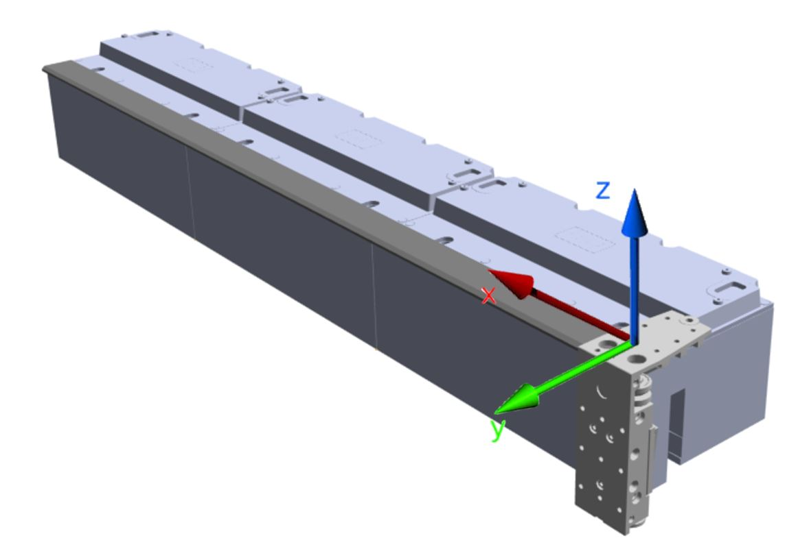

# Cartesian Coordinate System of the Track

The origin of the cartesian coordinate system of the track is identical to the origin of the linear coordinate system of the track. No offsets can be applied to the origin or to the orientation of the cartesian coordinate system. The origin of the cartesian coordinate system of the track is defined by the position of the Sercos infeed of a closed or an open track.

The cartesian coordinate system of the track is a right-handed coordinate system.

For more information on the linear coordinate system of a Lexium™ MC multi carrier track, refer to the description of the [Linear Coordinate System](IntroMC_CoordSys-0FC9FA31.html#IntroMC_CoordSys-0FC9FA31__CoordinateSystem-0FC9F017).

Example of a cartesian coordinate system on a Lexium™ MC multi carrier track 

EIO0000004641.10