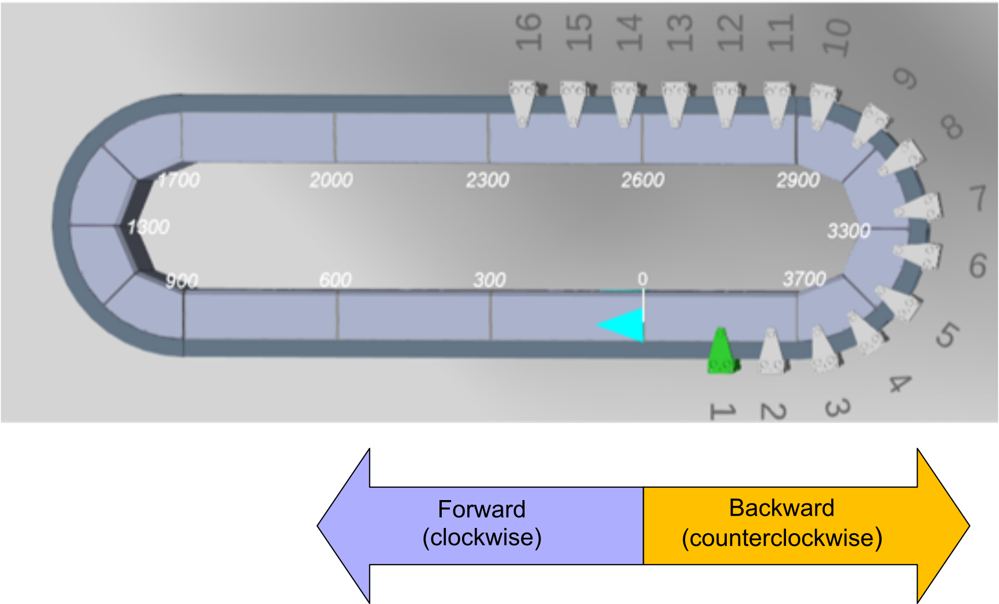
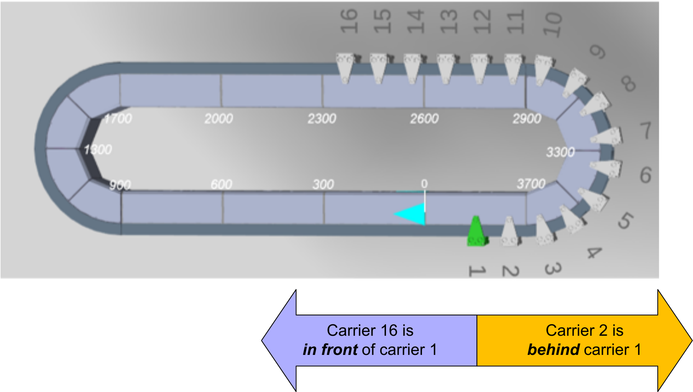

# Moving Directions

## Forward – Backward

A carrier can move forward or backward. The forward and backward moving direction is defined by the configured working direction:

**Closed Track:**

* In a closed track with clockwise working direction, the forward direction (positive movement) is clockwise.
* In a closed track with clockwise working direction, the backward direction (negative movement) is counterclockwise.
* In a closed track with counterclockwise working direction, the forward direction (positive movement) is counterclockwise.
* In a closed track with counterclockwise working direction, the backward direction (negative movement) is clockwise.

**Open Track:**

* In an open track with working direction from left to right, the forward direction (positive movement) is from left to right.
* In an open track with working direction from left to right, the backward direction (negative movement) is from right to left.
* In an open track with working direction from right to left, the forward direction (positive movement) is from right to left.
* In an open track with working direction from right to left, the backward direction (negative movement) is from left to right.

A movement of the carrier in positive moving direction (forward) corresponds to increasing position values, a movement in negative moving direction (backward) corresponds to decreasing position values.

Moving Directions for Working Direction Clockwise (Example) 

## In Front – Behind

In a track with more than two carriers, a carrier has one carrier in front and one carrier behind. Whether a carrier is in front or behind is defined by the configured working direction.

In Front / Behind for Working Direction Clockwise (Example) 

NOTE: In the Multicarrier library, the carrier under discussion is simply called "the carrier". If the carrier under discussion is considered in relationship to the next carrier in the moving direction or to a carrier behind or in front, this is made clear by expressions like "the selected carrier”, “the next carrier", "the carrier in front" or "the carrier behind".

EIO0000004641.10