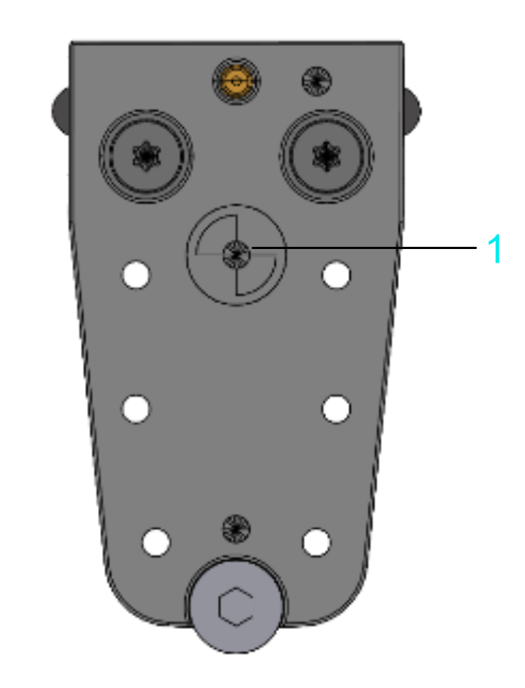
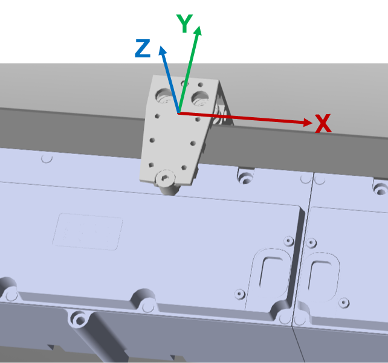

# Carrier Center Point

## Carrier Center Point

The position of a carrier on the track refers to the center point of the carrier.

The center point of a carrier is marked on the carrier.

Carrier Center Point (Top View of Carrier) 

| Item | Description |
| --- | --- |
| 1 | Center point of the carrier |

## Carrier Coordinate System

The coordinate system of a carrier is related to its center point. This is independent of the working direction of the track (see [Working Direction](IntroMC_CoordSys-0FC9FA31.html#IntroMC_CoordSys-0FC9FA31__WorkingDirection-0FC9F3F6)).

EIO0000004641.10