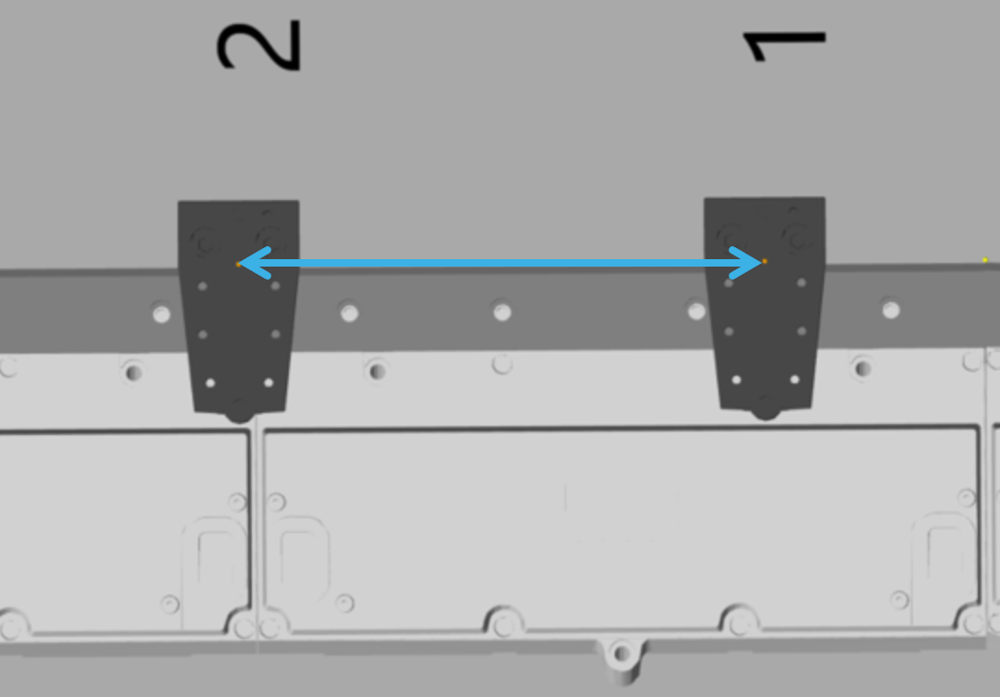
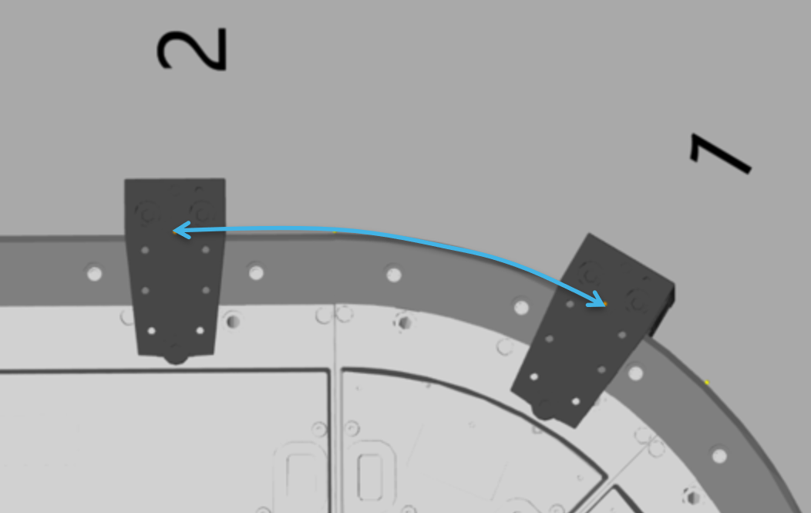
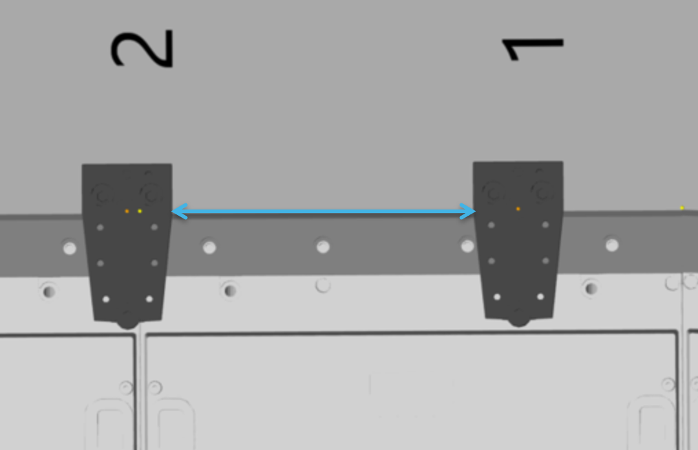
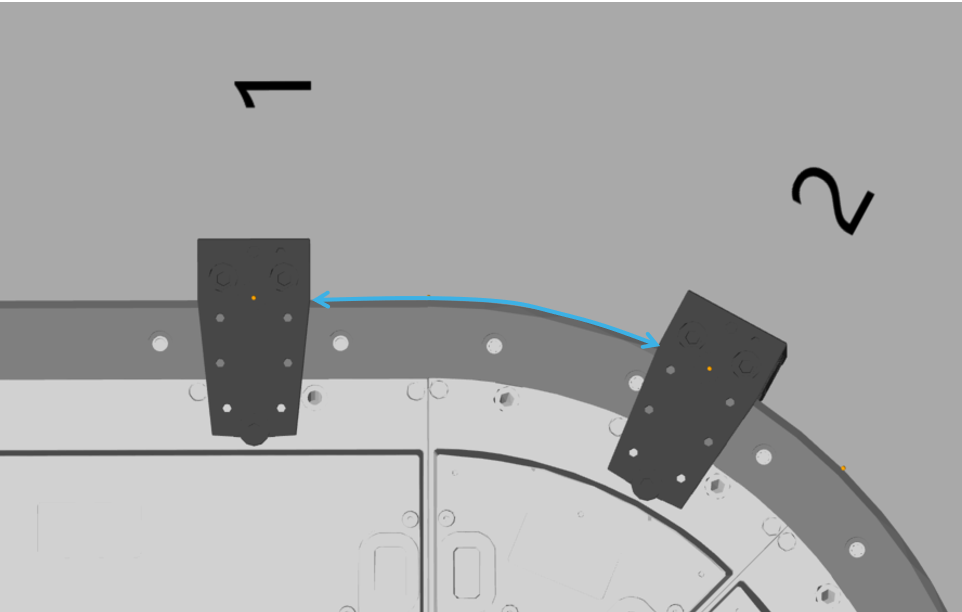
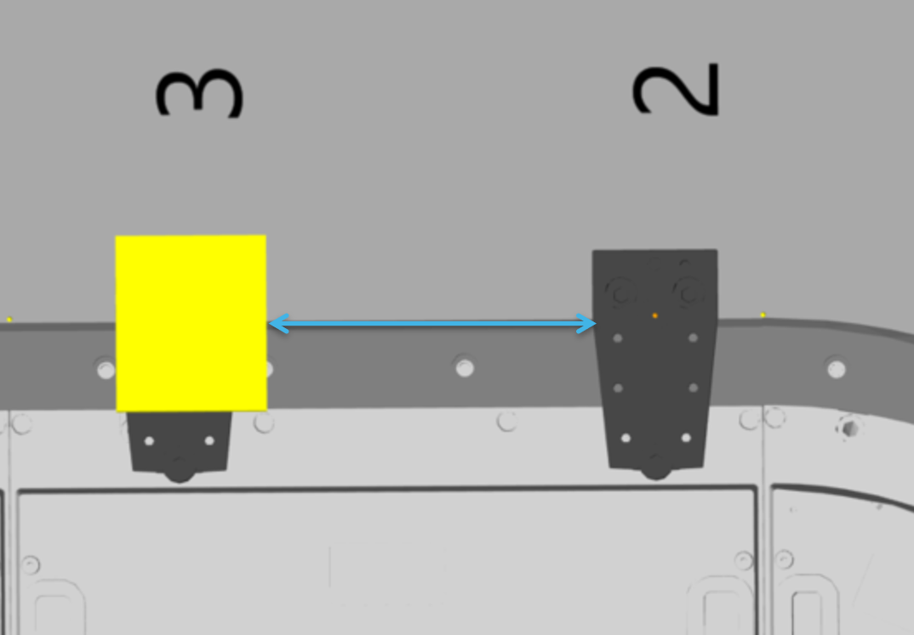
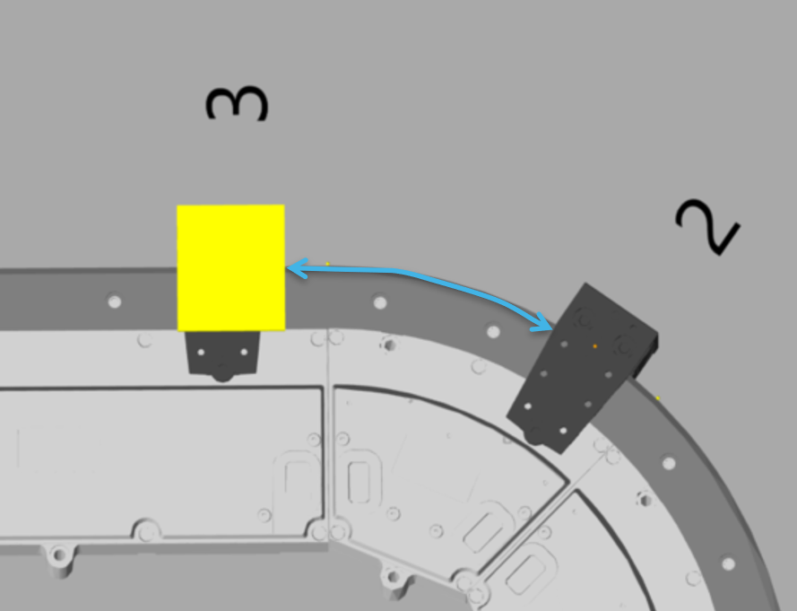

# Distance and Gap

## Distance

The distance between the two carriers is specified from the center point of one carrier to the center point of the next carrier. For the definition of the center point of a carrier, see [Carrier Center Point](IntroMC_CarrCenter-16E8092C.html#IntroMC_CarrCenter-16E8092C).

In the curves, the distance used is the arc length of the curve described by the carrier center point.

Distance between Carriers  

## Gap

The gap between two carriers is specified from the rear end of one carrier to the front end of the next carrier. Products and/or tools for transporting the products are taken into account.

In the curves, the gap used is the arc length of the curve between the two carriers.

Gap between Carriers    

EIO0000004641.10