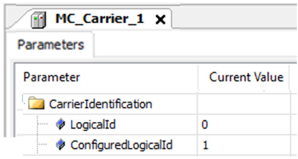
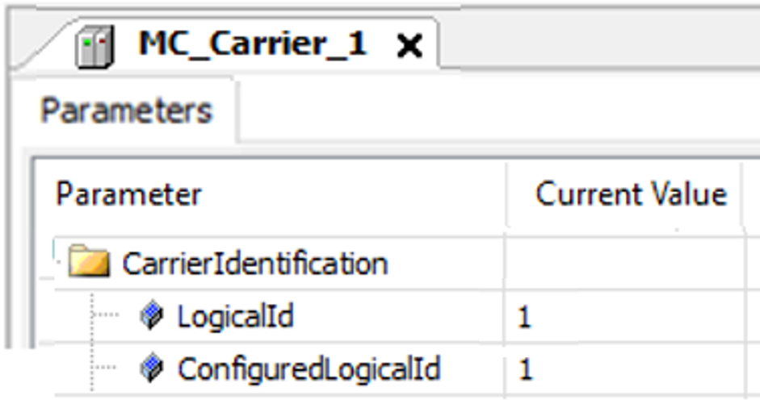
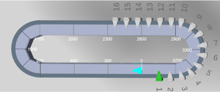
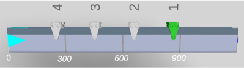
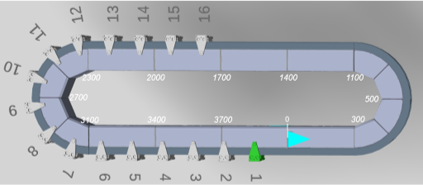
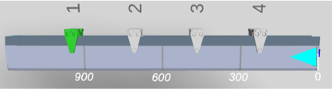
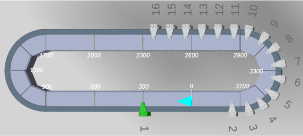
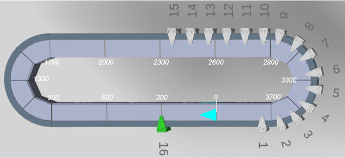

# Assignment of Carrier ID

## Description

Before the first Sercos phase-up, you must define the identification numbers (IDs) of your carriers with the parameter ConfiguredLogicalId in the CarrierIdentification user function of the Lexium MC Carrier object.

For more information on the user functions and device objects of the Lexium™ MC multi carrier, refer to the [Lexium™ MC multi carrier Device Objects and Parameters Guide](../../../../../api/crossBook?lang=en-US&virtualBookName=MCRDOaPG&topicID=).

Assignment of physical ID (Example) 

After the first Sercos phase-up, the assignment of the carriers is automatically performed by the system in two steps:

1. In the first step, the mechanical position of a carrier is automatically detected by the system and the firmware assigns the identification number 1 (LogicalId 1) to the carrier with the greatest position value. The carrier with the second-greatest position value is assigned the LogicalId 2 and so on.

   NOTE: The mechanical position of the carrier is automatically detected by the system.
2. In the second step, the logical carrier objects (LogicalId) are linked to the IDs of the carriers on the track (ConfiguredLogicalId).

Assignment of logical ID to physical ID (Example) 

The assignment of the carrier ID is applicable to tracks with default and inverted working direction and for closed and open tracks.

Assignment of Carrier ID 1 (LogicalID 1) – Default Working Direction  

Assignment of Carrier ID 1 (LogicalID 1) – Inverted Working Direction  

## New assignment

In case of a new Sercos phase-up (e.g. after a stop of the Lexium™ MC multi carrier transport system), the carrier IDs (LogicalId) are assigned to the carriers according to the position of the carriers on the track.

This is illustrated by the following example:

1. First Sercos phase-up: The green marked carrier is assigned the ID number 1.

   
2. The green marked carrier with ID number 1 is moved to position 300.

   
3. New Sercos phase-up: The carriers are assigned a new ID. The green marked carrier is now assigned the ID number 16.

   

EIO0000004641.10