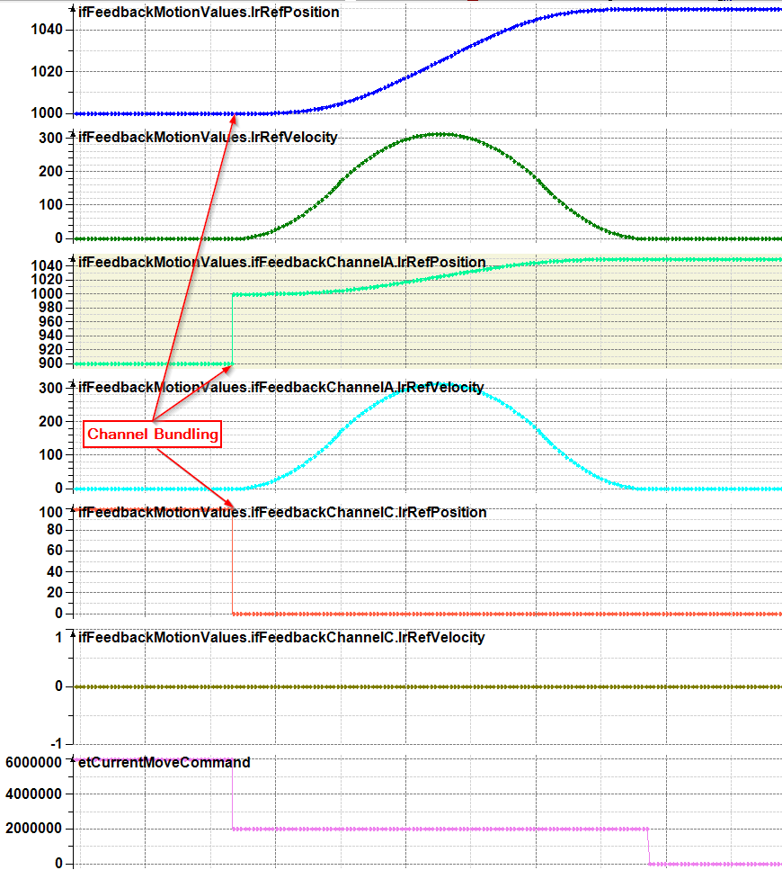

# Move Commands and Channels

## Reference Position Generator

For the generation of reference values of a carrier, the SoMotionGenerator (SMG) is used internally. It provides independent channels. These channels (designated A, B and C) generate individual position reference values whose sum is the resulting reference value which is transferred to the carrier.

|  |  |  |
| --- | --- | --- |
| Reference value channel A | Reference value channel B | Resulting reference value |

The SMG can process positioning as well as cam jobs. The motion jobs to be assigned are parameterized within the structure [ST\_MotionJob](../../../../../api/crossBook?lang=en-US&virtualBookName=PD.Lib.SoMotionGenerator&topicID=D_SE_0089488) of the PD\_SoMotionGenerator library and directly assigned to the individual channels by the method [TakeJob](../../../../../api/crossBook?lang=en-US&virtualBookName=PD.Lib.SoMotionGenerator&topicID=D_SE_0089467) specified in the PD\_SoMotionGenerator library.

For more information on the SoMotionGenerator, refer to the [PD\_SoMotionGenerator library](../../../../../api/crossBook?lang=en-US&virtualBookName=PD.Lib.SoMotionGenerator&topicID=).

The motion jobs are defined with the move commands of the MCR library, for example MoveDirectly.

## Move Commands on Different Channels

By default, the move commands are executed on channel A. Only the move commands for superimposed movements and the move command MovePureSmg can additionally use the channel B or C.

The following move commands are executed on channel A:

* [ifMotion.ifMoveDirectly.Start](IF_MoveDirectly-StartMethod-5445716E.html)
* [ifMotion.ifMoveDirectly.Stop](MoveDirectStop-0268322F.html)
* [ifMotion.ifMoveGapControl.Start](IF_MoveGapControl-StartMethod-53C5DF88.html)
* [ifMotion.ifMoveGapControl.Stop](MoveGapCtrlStop-03D5662C.html)
* [ifMotion.ifMoveSyncFromStandstill.StartSyncToCarrierInFront](IF_MoveSyncPathFromStandstill-Start-586FE52E.html)
* [ifMotion.ifMoveSyncFromStandstill.StartSyncToCarrierBehind](StartSyncBehind-B8AE4772.html)
* [ifMotion.ifMoveSyncFromStandstill.StartSyncToExternalMaster](MoveSyncExtMaster-080435F3.html)
* [ifMotion.ifMoveSyncFromStandstill.Stop](MoveSync-Stop-B2FD10BA.html)
* [ifMotion.ifJogging.Start](JogStart-03D85801.html)
* [ifMotion.ifJogging.Stop](JogStop-03D9541E.html)
* [ifMotion.StopCarrier](IF_MotionStopCarrier-587B0D50.html)
* [ifMotion.StopCarrierWithEmergencyParameter](StopCarrierEmergPara-AF81B4BA.html)
* [ifMotion.ifMovePosAndSync.Stop](MovePosAndSync-Stop-453CC880.html)

The following move commands are executed on channel B:

* [ifMotion.ifMoveSyncFromStandstill.StartCurveCompensationToCarrierInFront](IF_MoveSyncPathFromStandstill-Start-58861273.html)

The following move commands are executed on channel C:

* [ifMotion.ifMoveSyncFromStandstill.ifSuperimposedChannelC.StartAbsolutePositioning](SuperimpCStartAbsPos-2FA04A9F.html)
* [ifMotion.ifMoveSyncFromStandstill.ifSuperimposedChannelC.Stop](SuperimpChanCStop-3654BE20.html)

The following move commands are executed on a selectable channel (A, B or C):

* [ifMotion.ifMovePosAndSync.SetposRelativeChannelABC](MovePosAndSync-SetposRel-46AAC209.html)
* [ifMotion.ifMovePosAndSync.StartPositioning](MovePosAndSync-StartPos-45306F20.html)
* [ifMotion.ifMovePosAndSync.StartSyncFromStandstill](MovePosAndSync-StartSyncFrStand-4544E151.html)
* [ifMotion.ifMovePosAndSync.StartSyncOnTheFly](MovePosSync-SyncOnTheFly-45C04DE3.html)
* [ifMotion.ifMovePosAndSync.StartSyncStep](MovePosAndSync-StartSyncStep-46B83CD1.html)
* [ifMotion.ifMovePosAndSync.StopChannel](IF_MovePosAndSync-StopChann-453F2AC3.html)

## Change of Move Commands (Channel Bundling)

A new move command aborts the active motion jobs of the three channels, adds up their reference values and starts the new move command on channel A with the bundled value as a starting condition.

The following move commands use channel bundling:

* ifMotion.ifMoveDirectly.Start
* ifMotion.ifMoveDirectly.Stop
* ifMotion.ifMoveGapControl.Start
* ifMotion.ifMoveGapControl.Stop
* ifMotion.ifJogging.Start
* ifMotion.ifJogging.Stop
* ifMotion.StopCarrier
* ifMotion.StopCarrierWithEmergencyParameter
* ifMotion.ifMoveSyncFromStandstill.Stop
* ifMotion.ifMovePosAndSync.StartPositioning if i\_xChannelBundling = TRUE and i\_etChannel = SMG.ET\_Channel.A
* ifMotion.ifMovePosAndSync.Stop

**Example**

Preconditions:

* Reference value on channel A = 900 (mm)
* Reference value on channel C = 100 (mm)
* Reference position of the carrier = 1000 (mm)

1. You specify a new move command MoveDirectly with the positioning mode Absolute and a target value of 1050 mm.
2. With channel bundling, the motion values on channel C are transferred to channel A. The reference position of the carrier on channel A is now 1000 mm.
3. The move command MoveDirectly is executed on channel A: The movement starts at 1000 mm and ends at 1050 mm.

NOTE: If you want to start a motion job on different channels, you can use the method [SetposRelativeChannelABC](SetposRelABC-CBA8C8FC.html).

|  |  |
| --- | --- |
|  | For a visual illustration of channel splitting with the method SetposRelativeChannelABC and of channel bundling, refer to the [channels ABC](../../../../../api/video?lang=en-US&bookKey=12b7d85fa51c27993eba220464d3f92e7f4b2e169ad9a7e8385a2a97ab6ec332&videoName=MLSLib_ChannABC.mp4) video sequence. |

EIO0000004641.10