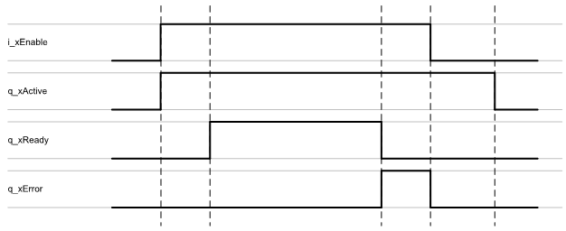

# Behavioral Model

## General Information

The behavioral model describes the common behavior of all function blocks provided by this library.

By setting the input i\_xEnable to TRUE, the function block starts the enabling process. The function block continues initialization and the output q\_xActive is set to TRUE. Once the initialization is finished, the output q\_xReady is set to TRUE.

If an error occurs, the output q\_xError indicates TRUE and remains TRUE until the function block is disabled.

## Signal Diagram

## Common Input

| Input | Data type | Description |
| --- | --- | --- |
| i\_xEnable | BOOL | A rising edge FALSE -> TRUE activates and initializes the function block, a falling edge TRUE -> FALSE deactivates the function block. A deactivated function block does not execute actions and the outputs are set to the default value. |

## Common Outputs

| Output | Data type | Description |
| --- | --- | --- |
| q\_xActive | BOOL | Indicates TRUE if the execution of the function block is active. As long as the output is TRUE, the function block must be executed cyclically. |
| q\_xReady | BOOL | Indicates TRUE if the function block is ready and can be controlled through its inputs according to its functionality.  After the function block has been enabled with a rising edge of i\_xEnable, the output q\_xReady is only set to TRUE if the function block can process instructions from the inputs.  If invalid input values are detected during initialization, q\_xReady remains FALSE.  If the function block has detected an error, q\_xReady is set to FALSE.  If the function block is deactivated using i\_xEnable, q\_xReady immediately becomes FALSE. |
| q\_xError | BOOL | Indicates TRUE if an error has been detected. For details, refer to q\_etResult and q\_sResultMsg. |
| q\_etResult | [ET\_Result](ET_Result-509D6EF3.html#ET_Result-509D6EF3) | Provides diagnostic and status information as a numeric value. If q\_xError = FALSE, q\_etResult provides status information. If q\_xError = TRUE, q\_etResult provides diagnostic/error information. |
| q\_sResultMsg | STRING [255] | Provides additional diagnostic and status information as a text message. |

EIO0000004641.10