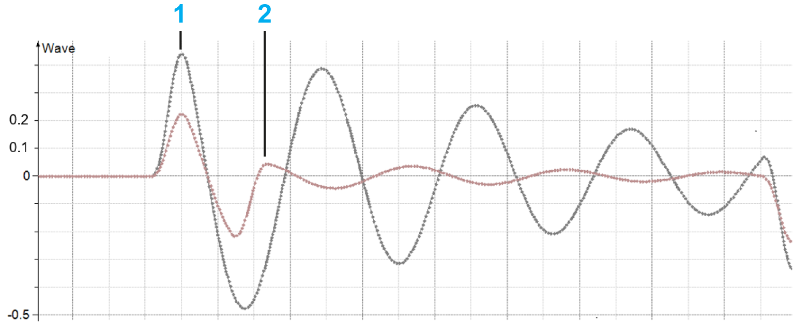
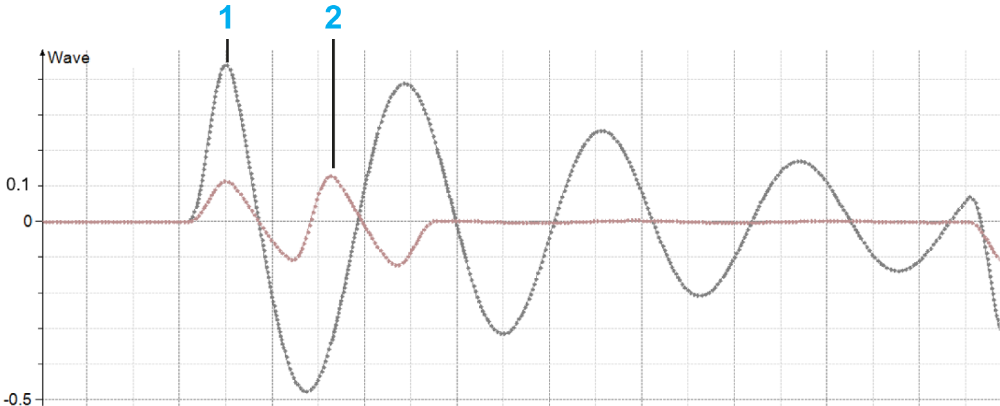
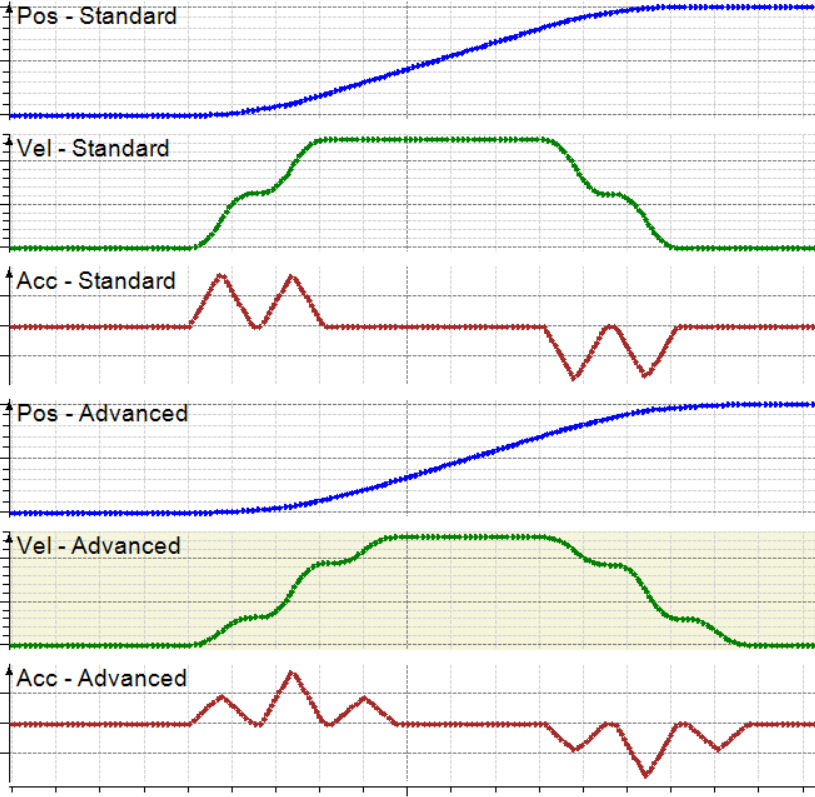

# ET\_AntisloshMode - General Information

## Overview

|  |  |
| --- | --- |
| Type: | Enumeration |
| Available as of: | V1.3.7.0 |

## Description

The enumeration ET\_AntisloshMode specifies two antislosh modes with different motion profiles.

Standard Antislosh Wave vs. Non-antislosh Wave 

**1** Non-antislosh wave

**2** Standard antislosh wave

Advanced Antislosh Wave vs. Non-antislosh Wave 

**1** Non-antislosh wave

**2** Advanced antislosh wave

Antislosh Motion Profiles: Standard and Advanced 

## Enumeration Elements

| Name | Value (UINT) | Description |
| --- | --- | --- |
| Standard | 0 | Default antislosh mode. For more information on the antislosh functionality, refer to the method [IF\_MoveGapControl - StartAntislosh](MoveGap-StartAntislosh-86A10BCB.html#MoveGap-StartAntislosh-86A10BCB) or [IF\_MoveDirectly - StartAntislosh](MoveDirectly-StartAntislosh-86A6B45A.html#MoveDirectly-StartAntislosh-86A6B45A). |
| Advanced | 1 | Antislosh functionality with a motion profile that allows a greater antislosh effect. The time period for the execution of the advanced antislosh motion profile is longer than for the default antislosh motion profile (see graphics above). |

## Used By

* [IF\_CarrierConfiguration - SetAntisloshParameter](CarrConfig_SetAntislosh-86359640.html#CarrConfig_SetAntislosh-86359640)

EIO0000004641.10