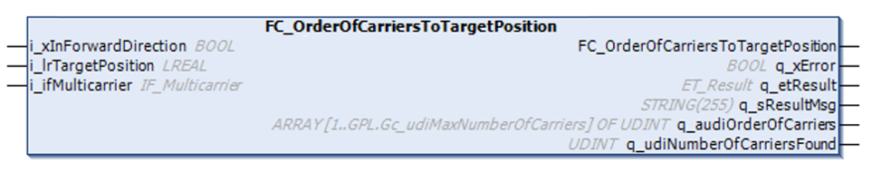
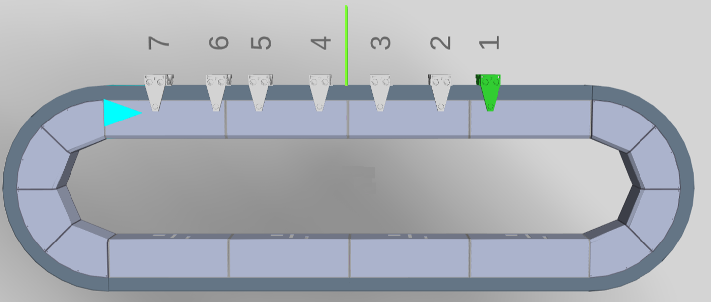
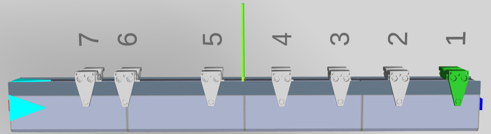

# FC\_OrderOfCarriersToTargetPosition - General Information

## Overview

|  |  |
| --- | --- |
| Type: | Function |
| Available as of: | V1.0.0.0 |

## Task

Providing the order of carriers in relation to a given target position.

## Description

The function FC\_OrderOfCarriersToTargetPosition provides a numbered order of carriers in relation to a given target position, considering the moving direction of the carriers.

This information can be used to add carriers in the right order to a station within a Lexium™ MC multi carrier track. For more information on station handling, refer to the [MulticarrierStation library](../../../../../api/crossBook?lang=en-US&virtualBookName=MCRSLib&topicID=).

Closed track (example) 

Moving direction of the carriers: from left to right (clockwise). The target position is marked with a green line.

The resulting carrier order in forward direction (i\_xInForwardDirection = TRUE) is as follows:

|  |  |
| --- | --- |
| Order number | Carrier index |
| 1 | 4 |
| 2 | 5 |
| 3 | 6 |
| 4 | 7 |
| 5 | 1 |
| 6 | 2 |
| 7 | 3 |

Open track (example) 

Moving direction of the carriers: from left to right (clockwise). The target position is marked with a green line.

The resulting carrier order in forward direction (i\_xInForwardDirection = TRUE) is as follows:

|  |  |
| --- | --- |
| Order number | Carrier index |
| 1 | 5 |
| 2 | 6 |
| 3 | 7 |

## Inputs

| Input | Data type | Description |
| --- | --- | --- |
| i\_xInForwardDirection | BOOL | If i\_xInForwardDirection is set to TRUE, the carrier index numbers are determined in forward direction. If i\_xInForwardDirection is set to FALSE, the carrier index numbers are determined in backward direction. |
| i\_lrTargetPosition | LREAL | Specifies the target position for determining the carrier index numbers for the related carriers. |
| i\_ifMulticarrier | IF\_Multicarrier | Interface for assigning the function block [FB\_Multicarrier](FB_Multicarrier-GeneralInformation-5134B521.html#FB_Multicarrier-GeneralInformation-5134B521). |

## Outputs

| Output | Data type | Description |
| --- | --- | --- |
| q\_xError | BOOL | Indicates TRUE if an error has been detected. For details, refer to q\_etResult and q\_sResultMsg. |
| q\_etResult | [ET\_Result](ET_Result-509D6EF3.html#ET_Result-509D6EF3) | Provides diagnostic and status information as a numeric value. If q\_xError = FALSE, q\_etResult provides status information. If q\_xError = TRUE, q\_etResult provides diagnostic/error information. |
| q\_sResultMsg | STRING [255] | Provides additional diagnostic and status information as a text message. |
| q\_audiOrderOfCarriers | ARRAY [1..GPL.Gc\_udiMaxNumberOfCarriers] OF UDINT | The array provides the index numbers of the carriers directed to the target position specified by the input i\_lrTargetPosition.  The order of the carriers depends on the input i\_xInForwardDirection. |
| q\_udiNumberOfCarriersFound | UDINT | The number of carriers on the track directed toward the target position. |

EIO0000004641.10