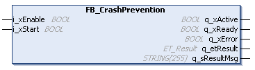

# FB\_CrashPrevention - General Information

## Overview

|  |  |
| --- | --- |
| Type: | Function block |
| Available as of: | V1.0.0.0 |

## Task

Function block for helping to prevent carrier collision.

## Description

A collision prevention function has been implemented for preventing mechanical damage to the system. It stops the carriers before they come too close to each other.

The instance of the function block FB\_CrashPrevention must be called cyclically.

If the calculated distance between the carriers is lower than the minimum distance defined by the parameter lrCrashDistance (see [ST\_CrashPreventionParameter](ST_CrashPreventionParameter-50328D0E.html#ST_CrashPreventionParameter-50328D0E)), the complete Lexium™ MC multi carrier transport system is stopped.

The collision prevention is the second layer to help prevent a collision between carriers. It is the backup option if the MoveGapControl command is unsuccessful or if a move command (like for example MoveDirectly or MoveSync) has not been correctly parametrized.

## Properties

| Name | Data type | Accessing | Description |
| --- | --- | --- | --- |
| ifMulticarrier | IF\_Multicarrier | Read/Write | Interface to the function block [FB\_Multicarrier](FB_Multicarrier-GeneralInformation-5134B521.html#FB_Multicarrier-GeneralInformation-5134B521). |
| stParameter | ST\_CrashPreventionParameter | Read/Write | Property for input of the structure [ST\_CrashPreventionParameter](ST_CrashPreventionParameter-50328D0E.html#ST_CrashPreventionParameter-50328D0E). |

## Inputs

| Input | Data type | Description |
| --- | --- | --- |
| i\_xEnable | BOOL | A rising edge FALSE -> TRUE activates and initializes the function block, a falling edge TRUE -> FALSE deactivates the function block. A deactivated function block does not execute actions and the outputs are set to the default value. |
| i\_xStart | BOOL | A rising edge of the input starts the function block. |

## Outputs

| Output | Data type | Description |
| --- | --- | --- |
| q\_xActive | BOOL | Indicates TRUE if the execution of the function block is active. As long as the output is TRUE, the function block must be executed cyclically. |
| q\_xReady | BOOL | Indicates TRUE if the function block is ready and can be controlled through its inputs according to its functionality.  After the function block has been enabled with a rising edge of i\_xEnable, the output q\_xReady is only set to TRUE if the function block can process instructions from the inputs.  If invalid input values are detected during initialization, q\_xReady remains FALSE.  If the function block has detected an error, q\_xReady is set to FALSE.  If the function block is deactivated using i\_xEnable, q\_xReady immediately becomes FALSE. |
| q\_xError | BOOL | Indicates TRUE if an error has been detected. For details, refer to q\_etResult and q\_sResultMsg. |
| q\_etResult | [ET\_Result](ET_Result-509D6EF3.html#ET_Result-509D6EF3) | Provides diagnostic and status information as a numeric value. If q\_xError = FALSE, q\_etResult provides status information. If q\_xError = TRUE, q\_etResult provides diagnostic/error information. |
| q\_sResultMsg | STRING [255] | Provides additional diagnostic and status information as a text message. |

EIO0000004641.10