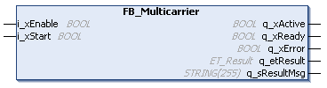

# FB\_Multicarrier - General Information

## Overview

|  |  |
| --- | --- |
| Type: | Function block |
| Available as of: | V1.0.0.0 |

## Task

Main function block for a Lexium™ MC multi carrier transport system.

## Description

The function block FB\_Multicarrier is the central administration function block for a Lexium™ MC multi carrier ring or line topology. It controls the segments and carriers of the Lexium™ MC multi carrier transport system.

The instance of the function block FB\_Multicarrier must be called cyclically.

The commands for configuration and motion programming as well as the feedback are performed via interfaces. The general entry point is the interface [IF\_Multicarrier](IF_Multicarrier-E051E650.html#IF_Multicarrier-E051E650). From this interface, the architecture is split into several sub-interfaces.

## Properties

| Name | Data type | Accessing | Description |
| --- | --- | --- | --- |
| ifConfiguration | IF\_MulticarrierConfiguration | Read | Access to the interface IF\_MulticarrierConfiguration for configuring the Lexium™ MC multi carrier track (see [IF\_MulticarrierConfiguration](IF_MulticarrierConfiguration-Genera-7E89F357.html#IF_MulticarrierConfiguration-Genera-7E89F357)). |
| ifFeedback | IF\_MulticarrierFeedback | Read | Access to the interface IF\_MulticarrierFeedback for reading general feedback information from the Lexium™ MC multi carrier transport system (see [IF\_MulticarrierFeedback](MCFeedback-D64BDD9A.html#MCFeedback-D64BDD9A)). |
| raifCarrier | REFERENCE TO ARRAY [1..GPL.Gc\_udiMaxNumberOfCarriers] OF IF\_Carrier | Read | Access to the functions of a carrier.  For more information, see [IF\_Carrier](IF_Carrier-E050ABF7.html#IF_Carrier-E050ABF7) |

## Inputs

| Input | Data type | Description |
| --- | --- | --- |
| i\_xEnable | BOOL | A rising edge FALSE -> TRUE activates and initializes the function block, a falling edge TRUE -> FALSE deactivates the function block. A deactivated function block does not execute actions and the outputs are set to the default value. |
| i\_xStart | BOOL | A rising edge of the input starts the function block. |

## Outputs

| Output | Data type | Description |
| --- | --- | --- |
| q\_xActive | BOOL | Indicates TRUE if the execution of the function block is active. As long as the output is TRUE, the function block must be executed cyclically. |
| q\_xReady | BOOL | Indicates TRUE if the function block is ready and can be controlled through its inputs according to its functionality.  After the function block has been enabled with a rising edge of i\_xEnable, the output q\_xReady is only set to TRUE if the function block can process instructions from the inputs.  If invalid input values are detected during initialization, q\_xReady remains FALSE.  If the function block has detected an error, q\_xReady is set to FALSE.  If the function block is deactivated using i\_xEnable, q\_xReady immediately becomes FALSE. |
| q\_xError | BOOL | Indicates TRUE if an error has been detected. For details, refer to q\_etResult and q\_sResultMsg. |
| q\_etResult | [ET\_Result](ET_Result-509D6EF3.html#ET_Result-509D6EF3) | Provides diagnostic and status information as a numeric value. If q\_xError = FALSE, q\_etResult provides status information. If q\_xError = TRUE, q\_etResult provides diagnostic/error information. |
| q\_sResultMsg | STRING [255] | Provides additional diagnostic and status information as a text message. |

EIO0000004641.10