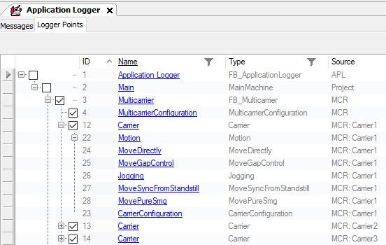

# FB\_Multicarrier - RegisterLoggerPoint (Method)

## Overview

|  |  |
| --- | --- |
| Type: | Method |
| Available as of: | V1.0.0.0 |

## Task

Registering the function block FB\_Multicarrier to the Application Logger.

## Description

With the method RegisterLoggerPoint, the function block FB\_Multicarrier is registered as a logger point in the global Application Logger.

The name of the function block in the Application Logger is defined by the input i\_sName.

The input i\_ifParent specifies the parent logger point under which the logger point for the function block FB\_Multicarrier must be registered in the logger point tree.

The function block FB\_Multicarrier adds further logger points for:

* the configuration of the Lexium™ MC multi carrier transport system (MulticarrierConfiguration)
* each carrier: the configuration of the carrier (CarrierConfiguration) and the motion function blocks (Motion, MoveDirectly, MoveGapControl, Jogging, MoveSyncFromStandstill, MovePureSmg)

The resulting number of logger points is calculated as follows:

* 2 logger points for the function block FB\_Multicarrier

* 8 logger points for each carrier (= number of carriers × 8)

Thus, for example for 10 carriers, there are 82 logger points.

The number of logger points must be considered for the value of the global parameter variable Gc\_udiMaxNumberOfLoggerPoints in the GPL (Global Parameter List) of the Application Logger library.

For more information on the GPL (Global Parameter List) of the Application Logger library, refer to [GPL (Global Parameter List)](../../../../../api/crossBook?lang=en-US&virtualBookName=PD.Lib.ApplicationLogger&topicID=D_SE_0077687).

For more general information on the Application Logger, refer to [Using the Application Logger](../../../../../api/crossBook?lang=en-US&virtualBookName=PD.Lib.ApplicationLogger&topicID=D_SE_0077693).

NOTE: As a prerequisite for using the method RegisterLoggerPoint, the Application Logger object must be added to the project and the Application Logger service must be registered.

## Inputs

| Input | Data type | Description |
| --- | --- | --- |
| i\_ifParent | APL.IF\_LoggerPoint | Parent logger point under which the logger point of the function block FB\_Multicarrier is registered. |
| i\_sName | STRING [80] | The name of the logger point that is shown in the Application Logger. |

## Outputs

| Output | Data type | Description |
| --- | --- | --- |
| q\_xError | BOOL | Indicates TRUE if an error has been detected. For details, refer to q\_etResult and q\_sResultMsg. |
| q\_etResult | [ET\_Result](ET_Result-509D6EF3.html#ET_Result-509D6EF3) | Provides diagnostic and status information as a numeric value. If q\_xError = FALSE, q\_etResult provides status information. If q\_xError = TRUE, q\_etResult provides diagnostic/error information. |
| q\_sResultMsg | STRING [255] | Provides additional diagnostic and status information as a text message. |

EIO0000004641.10