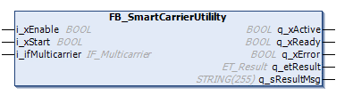

# FB\_SmartCarrierUtility - General Information

## Overview

|  |  |
| --- | --- |
| Type: | Function block |
| Available as of: | V1.8.4.0 |

## Task

Providing asynchronous mechanisms for reading the physical IDs of Smart Carriers and pairing the carriers.

## Description

On a Lexium™ MC multi carrier track, you can use two types of carriers: Smart Carriers with a predefined physical ID that is hard-coded in the carrier and Basic Carriers without predefined physical ID.

When using a Smart Carrier, the functions FC\_ReadCarriersPhysicalId and FC\_PairAllCarriers from the SystemInterface library must be called to identify the Smart Carriers and assign logical IDs to the carriers.

The function block FB\_SmartCarrierUtility provides the following property and methods:

* The method [StartReadingCarriersPhysicalIds](StartReadPhysicalIDs-B47ED712.html#StartReadPhysicalIDs-B47ED712)
* The method [StartPairingAllCarriers](StartPairAllCarriers-B89C4947.html#StartPairAllCarriers-B89C4947)
* The property etState (see [ET\_StateSmartCarrierUtility](ET_StateSmartCarrrUtil-B8A49744.html#ET_StateSmartCarrrUtil-B8A49744))

  

The instance of the function block FB\_SmartCarrierUtility must be called cyclically.

## Properties

| Name | Data type | Accessing | Description |
| --- | --- | --- | --- |
| etState | ET\_StateSmartCarrierUtility | Read | Access to the enumeration [ET\_StateSmartCarrierUtility](ET_StateSmartCarrrUtil-B8A49744.html#ET_StateSmartCarrrUtil-B8A49744) that displays the status of the running Smart Carrier-related sequence. |

## Inputs

| Input | Data type | Description |
| --- | --- | --- |
| i\_xEnable | BOOL | A rising edge FALSE -> TRUE activates and initializes the function block, a falling edge TRUE -> FALSE deactivates the function block. A deactivated function block does not execute actions and the outputs are set to the default value. |
| i\_xStart | BOOL | A rising edge of the input starts the function block. |
| i\_ifMulticarrier | IF\_Multicarrier | Interface for assigning the function block [FB\_Multicarrier](FB_Multicarrier-GeneralInformation-5134B521.html#FB_Multicarrier-GeneralInformation-5134B521). |

## Outputs

| Output | Data type | Description |
| --- | --- | --- |
| q\_xError | BOOL | Indicates TRUE if an error has been detected. For details, refer to q\_etResult and q\_sResultMsg. |
| q\_etResult | [ET\_Result](ET_Result-509D6EF3.html#ET_Result-509D6EF3) | Provides diagnostic and status information as a numeric value. If q\_xError = FALSE, q\_etResult provides status information. If q\_xError = TRUE, q\_etResult provides diagnostic/error information. |
| q\_sResultMsg | STRING [255] | Provides additional diagnostic and status information as a text message. |

EIO0000004641.10