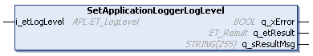

# FB\_SmartCarrierUtility - SetApplicationLoggerLogLevel (Method)

## Overview

|  |  |
| --- | --- |
| Type: | Method |
| Available as of: | V1.8.4.0 |

## Task

Setting the logger level of the Application Logger.

## Description

With the method SetApplicationLoggerLogLevel, you can specify the logger level of the Application Logger.

Three different logger levels from the Application Logger are supported:

* UserAction: Displays only messages caused by a user action (for example when you send a command)
* StatusMessage: Displays messages caused by a user action and additional status information
* DebugMessage: Displays messages caused by a user action, status information and additional parameters

NOTE: For performance reasons, set the logger level as low as possible. Only increase the logger level when required for analyzing and testing purposes.

For more information on the logger levels, refer to the enumeration [ET\_LogLevel](../../../../../api/crossBook?lang=en-US&virtualBookName=PD.Lib.ApplicationLogger&topicID=D_SE_0077662).

For more general information on the Application Logger, refer to [Using the Application Logger](../../../../../api/crossBook?lang=en-US&virtualBookName=PD.Lib.ApplicationLogger&topicID=D_SE_0077693).

## Inputs

| Input | Data type | Description |
| --- | --- | --- |
| i\_etLoglevel | APL.ET\_Loglevel | The logger level of the Application Logger.  The level specifies which kind of information is shown in the messages of the Application Logger. |

## Outputs

| Output | Data type | Description |
| --- | --- | --- |
| q\_xError | BOOL | Indicates TRUE if an error has been detected. For details, refer to q\_etResult and q\_sResultMsg. |
| q\_etResult | [ET\_Result](ET_Result-509D6EF3.html#ET_Result-509D6EF3) | Provides diagnostic and status information as a numeric value. If q\_xError = FALSE, q\_etResult provides status information. If q\_xError = TRUE, q\_etResult provides diagnostic/error information. |
| q\_sResultMsg | STRING [255] | Provides additional diagnostic and status information as a text message. |

EIO0000004641.10