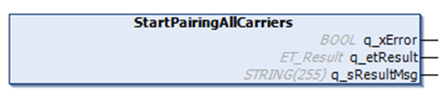

# FB\_SmartCarrierUtility - StartPairingAllCarriers (Method)

## Overview

|  |  |
| --- | --- |
| Type: | Method |
| Available as of: | V1.8.4.0 |

## Task

Writing the ConfiguredLogicalId to the carrier objects.

## Description

With the method StartPairingAllCarriers, you can start the process of writing the ConfiguredLogicalId to the Lexium™ MC multi carrier.

**Preconditions for the process:**

* The outputs q\_xActive and q\_xReady of the FB\_SmartCarrierUtility are TRUE.
* The instance of the function block does not execute another process.
* The multi carrier objects (track, segments, and carriers) of the [IF\_Multicarrier](IF_Multicarrier-E051E650.html#IF_Multicarrier-E051E650) must be in WorkingMode real / 1.
* The multi carrier carrier objects (Lexium MC Carrier) must not be enabled.
* Each carrier object on the track assigned to IF\_Multicarrier must have a unique ConfiguredLogicalId.
* The carrier objects must have a ConfiguredLogicalId that matches the LogicalId of any carrier on the selected track.

  

For more information on multi carrier objects and the parameter WorkingMode, refer to the [Lexium™ MC multi carrier Device Objects and Parameters Guide](../../../../../api/crossBook?lang=en-US&virtualBookName=MCRDOaPG&topicID=).

**Pairing process:**

By calling the method StartPairingAllCarriers, you start the pairing process that runs without further user action. You can verify the status of the process through the property etState (see [FB\_SmartCarrierUtility](SmartCarrierUtility-B8A36EDB.html#SmartCarrierUtility-B8A36EDB)).

The pairing process asynchronously calls the function FC\_PairAllCarriers from the SystemInterface library. For more information on the function FC\_PairAllCarriers, refer to the [SystemInterface library](../../../../../api/crossBook?lang=en-US&virtualBookName=PD.Lib.SystemInterface&topicID=FC_PairAllCarriers_Gen_4218A0D7).

  

NOTE: Do not modify the state of the Lexium MC Carrier objects during the pairing process.

NOTE: If at the end of the pairing process, the status message PairAllCarriersSuccessful is not displayed, you must repeat the process.

NOTE: After the pairing process, the value of the LogicalId is identical to the value of the ConfiguredLogicalId.  

For more information on the parameters LogicalId and ConfiguredLogicalId, refer to the [Lexium™ MC multi carrier Device Objects and Parameters Guide](../../../../../api/crossBook?lang=en-US&virtualBookName=MCRDOaPG&topicID=CarrIdent_9D6C0CE9)

## Inputs

The method has no inputs.

## Outputs

| Output | Data type | Description |
| --- | --- | --- |
| q\_xError | BOOL | Indicates TRUE if an error has been detected. For details, refer to q\_etResult and q\_sResultMsg. |
| q\_etResult | [ET\_Result](ET_Result-509D6EF3.html#ET_Result-509D6EF3) | Provides diagnostic and status information as a numeric value. If q\_xError = FALSE, q\_etResult provides status information. If q\_xError = TRUE, q\_etResult provides diagnostic/error information. |
| q\_sResultMsg | STRING [255] | Provides additional diagnostic and status information as a text message. |

EIO0000004641.10