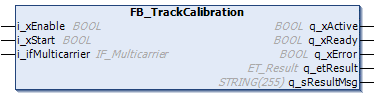

# FB\_TrackCalibration - General Information

## Overview

|  |  |
| --- | --- |
| Type: | Function block |
| Available as of: | V1.2.5.0 |

## Task

Calibrating the segment transitions of a Lexium™ MC multi carrier track.

## Description

Since the segments might not be spaced equally, a track calibration can improve the motion quality of the carrier when transitioning from segment to segment.

The function block FB\_TrackCalibration provides the following property and methods for performing a track calibration:

* the method [StartCalibration](FB_TrackCalibStart-6333E1D3.html#FB_TrackCalibStart-6333E1D3) for calibrating a track using a single carrier
* the method [StartCalibrationSingleSegment](StartCalibSingleSegment-86B9EB84.html#StartCalibSingleSegment-86B9EB84) for calibrating a single segment using a single carrier
* the method [StartCalibrationWithSyncCarrier](TrackCalibStartSyncCarr-869BDADD.html#TrackCalibStartSyncCarr-869BDADD) for calibrating a closed track using a selected carrier with synchronized carriers
* the method [StartMeasurement](FB_TrackCalibStartMeas-63BA9827.html#FB_TrackCalibStartMeas-63BA9827) for track measurement without writing the values to the segments
* the method [ResetTrackCalibration](FB_TrackCalibReset-63BD7AC0.html#FB_TrackCalibReset-63BD7AC0) for resetting the track calibration
* the property etState (see [ET\_StateTrackCalibration](ET_StateTrackCalib-62D35B64.html#ET_StateTrackCalib-62D35B64))

  

The instance of the function block FB\_TrackCalibration must be called cyclically.

## Properties

| Name | Data type | Accessing | Description |
| --- | --- | --- | --- |
| etState | ET\_StateTrackCalibration | Read | Access to the enumeration [ET\_StateTrackCalibration](ET_StateTrackCalib-62D35B64.html#ET_StateTrackCalib-62D35B64) that displays the status of the running track calibration sequence. |

## Inputs

| Input | Data type | Description |
| --- | --- | --- |
| i\_xEnable | BOOL | A rising edge FALSE -> TRUE activates and initializes the function block, a falling edge TRUE -> FALSE deactivates the function block. A deactivated function block does not execute actions and the outputs are set to the default value. |
| i\_xStart | BOOL | A rising edge of the input starts the function block. |
| i\_ifMulticarrier | IF\_Multicarrier | Interface for assigning the function block [FB\_Multicarrier](FB_Multicarrier-GeneralInformation-5134B521.html#FB_Multicarrier-GeneralInformation-5134B521). |

## Outputs

| Output | Data type | Description |
| --- | --- | --- |
| q\_xActive | BOOL | Indicates TRUE if the execution of the function block is active. As long as the output is TRUE, the function block must be executed cyclically. |
| q\_xReady | BOOL | Indicates TRUE if the function block is ready and can be controlled through its inputs according to its functionality.  After the function block has been enabled with a rising edge of i\_xEnable, the output q\_xReady is only set to TRUE if the function block can process instructions from the inputs.  If invalid input values are detected during initialization, q\_xReady remains FALSE.  If the function block has detected an error, q\_xReady is set to FALSE.  If the function block is deactivated using i\_xEnable, q\_xReady immediately becomes FALSE. |
| q\_xError | BOOL | Indicates TRUE if an error has been detected. For details, refer to q\_etResult and q\_sResultMsg. |
| q\_etResult | [ET\_Result](ET_Result-509D6EF3.html#ET_Result-509D6EF3) | Provides diagnostic and status information as a numeric value. If q\_xError = FALSE, q\_etResult provides status information. If q\_xError = TRUE, q\_etResult provides diagnostic/error information. |
| q\_sResultMsg | STRING [255] | Provides additional diagnostic and status information as a text message. |

EIO0000004641.10