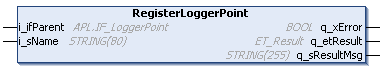

# FB\_TrackCalibration - RegisterLoggerPoint (Method)

## Overview

|  |  |
| --- | --- |
| Type: | Method |
| Available as of: | V1.2.5.0 |

## Task

Registering the function block FB\_TrackCalibration to the Application Logger.

## Description

With the method RegisterLoggerPoint, the function block FB\_TrackCalibration is registered as a logger point in the global Application Logger.

The name of the function block in the Application Logger is defined by the input i\_sName.

The input i\_ifParent specifies the parent logger point under which the logger point for the function block FB\_TrackCalibration must be registered in the logger point tree.

For more general information on the Application Logger, refer to [Using the Application Logger](../../../../../api/crossBook?lang=en-US&virtualBookName=PD.Lib.ApplicationLogger&topicID=D_SE_0077693).

NOTE: As a prerequisite for using the method RegisterLoggerPoint, the Application Logger object must be added to the project and the Application Logger service must be registered.

## Inputs

| Input | Data type | Description |
| --- | --- | --- |
| i\_ifParent | APL.IF\_LoggerPoint | Parent logger point under which the logger point of the function block FB\_TrackCalibration is registered. |
| i\_sName | STRING [80] | The name of the logger point that is shown in the Application Logger. |

## Outputs

| Output | Data type | Description |
| --- | --- | --- |
| q\_xError | BOOL | Indicates TRUE if an error has been detected. For details, refer to q\_etResult and q\_sResultMsg. |
| q\_etResult | [ET\_Result](ET_Result-509D6EF3.html#ET_Result-509D6EF3) | Provides diagnostic and status information as a numeric value. If q\_xError = FALSE, q\_etResult provides status information. If q\_xError = TRUE, q\_etResult provides diagnostic/error information. |
| q\_sResultMsg | STRING [255] | Provides additional diagnostic and status information as a text message. |

EIO0000004641.10