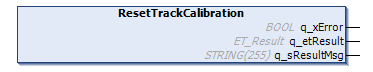

# FB\_TrackCalibration - ResetTrackCalibration (Method)

## Overview

|  |  |
| --- | --- |
| Type: | Method |
| Available as of: | V1.2.5.0 |

## Task

Resetting the track calibration.

## Description

With the method ResetTrackCalibration, you can reset the calibration values for the segments of a Lexium™ MC multi carrier track.

**Precondition for resetting the calibration values:**

* Ensure that the carrier and the function block [FB\_Multicarrier](FB_Multicarrier-GeneralInformation-5134B521.html#FB_Multicarrier-GeneralInformation-5134B521) are successfully enabled.

**Resetting process:**

By calling the method ResetTrackCalibration, you reset the calibration values for the track segments. After resetting the calibration values successfully, the enumeration [ET\_StateTrackCalibration](ET_StateTrackCalib-62D35B64.html#ET_StateTrackCalib-62D35B64) displays the status ResetTrackCalibrationSuccessful.

NOTE: After resetting the calibration values, you must perform a hardware reboot of the Lexium™ MC multi carrier track to activate the new calibration values.

NOTE: After resetting the calibration values, verify the positions of the stations on the track.

## Inputs

The method has no inputs.

## Outputs

| Output | Data type | Description |
| --- | --- | --- |
| q\_xError | BOOL | Indicates TRUE if an error has been detected. For details, refer to q\_etResult and q\_sResultMsg. |
| q\_etResult | [ET\_Result](ET_Result-509D6EF3.html#ET_Result-509D6EF3) | Provides diagnostic and status information as a numeric value. If q\_xError = FALSE, q\_etResult provides status information. If q\_xError = TRUE, q\_etResult provides diagnostic/error information. |
| q\_sResultMsg | STRING [255] | Provides additional diagnostic and status information as a text message. |

EIO0000004641.10