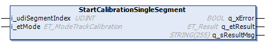
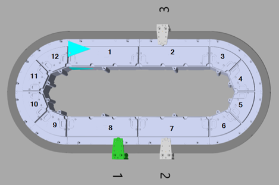
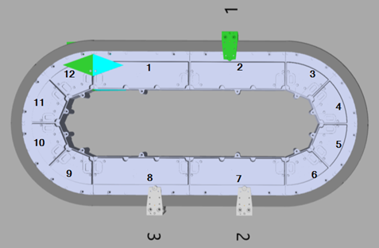

# FB\_TrackCalibration - StartCalibrationSingleSegment (Method)

## Overview

|  |  |
| --- | --- |
| Type: | Method |
| Available as of: | V1.3.7.0 |

## Task

Starting the calibration of one segment of a track.

## Description

With the method StartCalibrationSingleSegment, you can start the process of calibrating one segment of a Lexium™ MC multi carrier track.

The calibration area comprises three segments: one segment behind the selected segment, the selected segment and one segment in front of the selected segment. For the calibration of a track segment, only one carrier is allowed in the calibration area. This carrier is selected for the segment calibration. The other carriers can stay on the track.

**Preconditions for the calibration process:**

* There is not more than one carrier in the calibration area. This carrier must be empty (without tool and/or product).
* There are no mechanical obstacles for the carrier in the calibration area.
* Define the working direction of the track (not inverted or inverted) using the parameter Direction in the user function TrackGeometry of the track object Lexium MC Track. The default value of the parameter Direction is Not inverted / 1. (For more information on the parameter Direction, refer to the [Lexium™ MC multi carrier Device Objects and Parameters Guide](../../../../../api/crossBook?lang=en-US&virtualBookName=MCRDOaPG&topicID=Direction_F3623FD5).)
* Select the following control loop parameters:
  + i\_dwPosP := 500
  + i\_dwVelP:= 2000
  + i\_dwVelI := 500
* Ensure that the carrier and the function block [FB\_Multicarrier](FB_Multicarrier-GeneralInformation-5134B521.html#FB_Multicarrier-GeneralInformation-5134B521) are successfully enabled.
* Select the calibration mode in the enumeration [ET\_ModeTrackCalibration](ET_ModeTrackCalib-62D4BC95.html#ET_ModeTrackCalib-62D4BC95), depending on the [working direction](IntroMC_CoordSys-0FC9FA31.html#IntroMC_CoordSys-0FC9FA31__WorkingDirection-0FC9F3F6) of your Lexium™ MC multi carrier track in automatic operation mode.
* Select the segment index number (topological address) of the segment that you want to calibrate. The order of the segment index numbers is independent from the working direction of the track (not inverted or inverted). For more information on segment numbering, refer to the description of the [linear coordinate system](IntroMC_CoordSys-0FC9FA31.html#IntroMC_CoordSys-0FC9FA31__CoordinateSystem-0FC9F017).

  

**Calibration process:**

By calling the method StartCalibrationSingleSegment, you start the calibration process that runs without further user action. You can verify the status of the process through the property etState (see [FB\_TrackCalibration](FB_TrackCalibGen-6314E4FB.html#FB_TrackCalibGen-6314E4FB__Properties-6315052E)).

The calibration process includes the following stages:

1. The carrier moves to the initial position, which is the middle position of the segment behind the selected segment, seen in [moving direction](IntroMC_MovDir-10BB46E9.html#IntroMC_MovDir-10BB46E9).
2. The measurement is started.
3. The carrier moves from the middle of the segment behind the selected segment to the middle of the segment in front of the selected segment, seen in moving direction. (The motion parameters are defined inside the library).
4. The calibration values are calculated internally.
5. The parameters are written to the segment.
6. The enumeration [ET\_StateTrackCalibration](ET_StateTrackCalib-62D35B64.html#ET_StateTrackCalib-62D35B64) displays the status TrackCalibrationSuccessful.

  

NOTE: If at the end of the calibration process, the status message TrackCalibrationSuccessful is not displayed, you must repeat the process from the start.

NOTE: After the calibration process, you must perform a hardware reboot of the Lexium™ MC multi carrier track to activate the new calibration values.

NOTE: After the calibration process, the absolute positions on the track could be shifted. Therefore, verify the positions of the stations on the track.

NOTE: Do not execute any other move command during calibration run.

NOTE: The derived calibration result fits a unique hardware setup and only the selected track calibration mode. To get the best calibration results, repeat the calibration if the hardware setup was modified (exchange of any segments or change of their order) or the application movement direction changed.

## Examples

Working Direction of the Track: Not inverted 

**Example 1**

* i\_udiSegmentIndex = 2
* i\_etMode = MCR.ET\_ModeTrackCalibration.Forward
* Working direction: not inverted
* Calibration area: Segments 1, 2, 3
* Carrier 3 moves from the middle of segment 1 through segment 2 to the middle of segment 3.
* The calibration run ends at segment 3.

**Example 2**

* i\_udiSegmentIndex = 2
* i\_etMode = MCR.ET\_ModeTrackCalibration.Backward
* Working direction: not inverted
* Calibration area: Segments 3, 2, 1
* Carrier 3 moves from the middle of segment 3 through segment 2 to the middle of segment 1.
* The calibration run ends at segment 1.

**Example 3**

* i\_udiSegmentIndex = 2
* i\_etMode = MCR.ET\_ModeTrackCalibration.BothDirections
* Working direction: not inverted
* Calibration area: Segments 1, 2, 3
* Carrier 3 moves from the middle of segment 1 through segment 2 to the middle of segment 3 and then back from the middle of segment 3 through segment 2 to the middle of segment 1.
* The calibration run ends at segment 1.

**Example 4**

* i\_udiSegmentIndex = 7
* i\_etMode = MCR.ET\_ModeTrackCalibration.Forward
* Working direction: not inverted
* Calibration area: Segments 6, 7, 8
* In the calibration area, two carriers are present.
* An error is detected:
  + q\_xError is set to TRUE.
  + q\_etResult: diagnostic information ET\_Result.TrackCalibrationNumberOfCarriers (see [ET\_Result](ET_Result-509D6EF3.html#ET_Result-509D6EF3__EnumerationElements-509D8007))

**Example 5**

* i\_udiSegmentIndex = 4
* i\_etMode = MCR.ET\_ModeTrackCalibration.Forward
* Working direction: not inverted
* Calibration area: Segments 3, 4, 5
* In the calibration area, no carrier is present.
* An error is detected:
  + q\_xError is set to TRUE.
  + q\_etResult: diagnostic information ET\_Result.TrackCalibrationNumberOfCarriers (see [ET\_Result](ET_Result-509D6EF3.html#ET_Result-509D6EF3__EnumerationElements-509D8007))

Working Direction of the Track: Inverted 

**Example 6**

* i\_udiSegmentIndex = 2
* i\_etMode = MCR.ET\_ModeTrackCalibration.Forward
* Working direction: inverted
* Calibration area: Segments 3, 2, 1
* Carrier 1 moves from the middle of segment 3 through segment 2 to the middle of segment 1.
* The calibration run ends at segment 1.

**Example 7**

* i\_udiSegmentIndex = 2
* i\_etMode = MCR.ET\_ModeTrackCalibration.Backward
* Working direction: inverted
* Calibration area: Segments 1, 2, 3
* Carrier 1 moves from the middle of segment 1 through segment 2 to the middle of segment 3.
* The calibration run ends at segment 3.

**Example 8**

* i\_udiSegmentIndex = 2
* i\_etMode = MCR.ET\_ModeTrackCalibration.BothDirections
* Working direction: inverted
* Calibration area: Segments 1, 2, 3
* Carrier 1 moves from the middle of segment 3 through segment 2 to the middle of segment 1 and then back from the middle of segment 1 through segment 2 to the middle of segment 3.
* The calibration run ends at segment 3.

**Example 9**

* i\_udiSegmentIndex = 7
* i\_etMode = MCR.ET\_ModeTrackCalibration.Forward
* Working direction: inverted
* Calibration area: Segments 8, 7, 6
* In the calibration area, two carriers are present.
* An error is detected:
  + q\_xError is set to TRUE.
  + q\_etResult: diagnostic information ET\_Result.TrackCalibrationNumberOfCarriers (see [ET\_Result](ET_Result-509D6EF3.html#ET_Result-509D6EF3__EnumerationElements-509D8007))

**Example 10**

* i\_udiSegmentIndex = 4
* i\_etMode = MCR.ET\_ModeTrackCalibration.Forward
* Working direction: inverted
* Calibration area: Segments 5, 4, 3
* In the calibration area, no carrier is present.
* An error is detected:
  + q\_xError is set to TRUE.
  + q\_etResult: diagnostic information ET\_Result.TrackCalibrationNumberOfCarriers (see [ET\_Result](ET_Result-509D6EF3.html#ET_Result-509D6EF3__EnumerationElements-509D8007))

## Inputs

| Input | Data type | Description |
| --- | --- | --- |
| i\_etMode | ET\_ModeTrackCalibration | Access to the enumeration ET\_ModeTrackCalibration for selecting the track calibration mode, depending on the working direction of the track in automatic operation mode. |
| i\_udiSegmentIndex | UDINT | Selecting the segment index number (topological address) of the segment that you want to calibrate. The order of the segment index numbers is independent from the working direction of the track (not inverted or inverted). |

## Outputs

| Output | Data type | Description |
| --- | --- | --- |
| q\_xError | BOOL | Indicates TRUE if an error has been detected. For details, refer to q\_etResult and q\_sResultMsg. |
| q\_etResult | [ET\_Result](ET_Result-509D6EF3.html#ET_Result-509D6EF3) | Provides diagnostic and status information as a numeric value. If q\_xError = FALSE, q\_etResult provides status information. If q\_xError = TRUE, q\_etResult provides diagnostic/error information. |
| q\_sResultMsg | STRING [255] | Provides additional diagnostic and status information as a text message. |

EIO0000004641.10