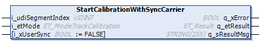

# FB\_TrackCalibration - StartCalibrationWithSyncCarrier (Method)

## Overview

|  |  |
| --- | --- |
| Type: | Method |
| Available as of: | V1.6.4.0 |

## Task

Starting track calibration with synchronized carriers on a closed track.

## Description

With the method StartCalibrationWithSyncCarrier, you can start the process of calibrating a closed Lexium™ MC multi carrier track, with synchronized carriers staying on the track.

For selecting the carrier for the calibration run, you select a segment with one carrier. This carrier is the selected carrier. The remaining carriers on the track must be synchronized to the selected carrier and can stay on the track during the calibration run.

NOTE: Open tracks are not supported.

**Preconditions for the calibration process:**

* The carriers are in standstill.
* There is not more than one carrier on the selected segment of the track.
* The segment in front of the selected segment is free of carriers.
* The segment behind the selected segment is free of carriers.
* The selected carrier is not mechanically connected to another carrier.
* There are no mechanical obstacles for the carriers on the track.
* Define the working direction of the track (not inverted or inverted) using the parameter Direction in the user function TrackGeometry of the track object Lexium MC Track. The default value of the parameter Direction is Not inverted / 1. (For more information on the parameter Direction, refer to the [Lexium™ MC multi carrier Device Objects and Parameters Guide](../../../../../api/crossBook?lang=en-US&virtualBookName=MCRDOaPG&topicID=Direction_F3623FD5).)
* Select the control loop parameters for the carriers and the corresponding tools.
* Ensure that the carrier and the function block [FB\_Multicarrier](FB_Multicarrier-GeneralInformation-5134B521.html#FB_Multicarrier-GeneralInformation-5134B521) are successfully enabled.
* Select the track calibration mode in the enumeration [ET\_ModeTrackCalibration](ET_ModeTrackCalib-62D4BC95.html#ET_ModeTrackCalib-62D4BC95), depending on the [working direction](IntroMC_CoordSys-0FC9FA31.html#IntroMC_CoordSys-0FC9FA31__WorkingDirection-0FC9F3F6) of your Lexium™ MC multi carrier track in automatic operation mode.
* Select the segment index number (topological address) of the segment with the carrier that you want to use for calibration. The order of the segment index numbers is independent from the working direction of the track (not inverted or inverted). For more information on segment numbering, refer to the description of the [linear coordinate system](IntroMC_CoordSys-0FC9FA31.html#IntroMC_CoordSys-0FC9FA31).
* Use the Boolean input i\_xUserSync to select if the synchronization is performed by the library or by user action.
  + If i\_xUserSync is FALSE, the library synchronizes the remaining carriers on the track to the selected carrier.

    NOTE: Mechanically connected carriers are not allowed.
  + If i\_xUserSync is TRUE, you must synchronize the remaining carriers to the selected carrier within your application before the calibration process starts. With this option, you can handle mechanically connected carriers. The synchronization must be adapted to the mechanical needs of your machine. (For more information on the available synchronization methods, refer to the interface [IF\_MoveSyncFromStandstill](IF_MoveSyncPathFromStandstill-5B839E78.html#IF_MoveSyncPathFromStandstill-5B839E78).)

    NOTE: The selected carrier must not be mechanically connected to another carrier.

| CAUTION | |
| --- | --- |
|  | CARRIER Collision  Define the synchronization in a way that avoids collisions with other carriers.  Failure to follow these instructions can result in injury or equipment damage. |

NOTE: You can use the function block [FB\_CrashPrevention](FB_CrashPrev-B100416B.html#FB_CrashPrev-B100416B) as an additional protection measure to help avoid collisions.

  

**Calibration process:**

By calling the method StartCalibrationWithSyncCarrier, you start the calibration process that runs without further user action. You can verify the status of the process through the property etState (see [FB\_TrackCalibration](FB_TrackCalibGen-6314E4FB.html#FB_TrackCalibGen-6314E4FB__Properties-6315052E)).

The calibration process includes the following stages:

1. The selected carrier moves to the initial position, which is the middle position of the first segment of the track.
2. The measurement is started.
3. The carrier moves around the track from segment to segment until it reaches the initial position. (The motion parameters are defined inside the library).
4. The calibration values are calculated internally.
5. The parameters are written to the segments.
6. The enumeration [ET\_StateTrackCalibration](ET_StateTrackCalib-62D35B64.html#ET_StateTrackCalib-62D35B64) displays the status TrackCalibrationSuccessful.

  

NOTE: Do not execute any other move command during calibration run.

NOTE: If, at the end of the track calibration process, the status message TrackCalibrationSuccessful is not displayed, you must repeat the process from the start.

NOTE: After the calibration process, you must perform a hardware reboot of the Lexium™ MC multi carrier track to activate the new calibration values.

NOTE: After the track calibration, the absolute positions on the track could be shifted. Therefore, verify the positions of the stations on the track.

NOTE: The derived calibration result fits a unique hardware setup and only the selected track calibration mode. To get the best calibration results, repeat the calibration if the hardware setup was modified (exchange of any segments or change of their order) or the application movement direction changed.

NOTE: The function block FB\_TrackCalibration does not monitor the errors of the function block FB\_MultiCarrier. If you do not use the Multicarrier Example project, then use your own error handling for FB\_MultiCarrier.

## Inputs

| Input | Data type | Description |
| --- | --- | --- |
| i\_etMode | ET\_ModeTrackCalibration | Access to the enumeration ET\_ModeTrackCalibration for selecting the track calibration mode, depending on the working direction of the track in automatic operation mode. |
| i\_udiSegmentIndex | UDINT | Select the segment index number (topological address) of the segment with the carrier you want to use for calibration. The order of the segment index numbers is independent from the working direction of the track (not inverted or inverted). |
| i\_xUserSync | BOOL | If i\_xUserSync is FALSE, the library internally synchronizes the further carriers on the track to the selected carrier.  If i\_xUserSync is TRUE, you must synchronize the carriers within your application before the calibration process starts. |

## Outputs

| Output | Data type | Description |
| --- | --- | --- |
| q\_xError | BOOL | Indicates TRUE if an error has been detected. For details, refer to q\_etResult and q\_sResultMsg. |
| q\_etResult | [ET\_Result](ET_Result-509D6EF3.html#ET_Result-509D6EF3) | Provides diagnostic and status information as a numeric value. If q\_xError = FALSE, q\_etResult provides status information. If q\_xError = TRUE, q\_etResult provides diagnostic/error information. |
| q\_sResultMsg | STRING [255] | Provides additional diagnostic and status information as a text message. |

EIO0000004641.10