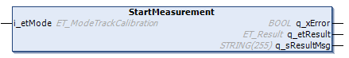

# FB\_TrackCalibration - StartMeasurement (Method)

## Overview

|  |  |
| --- | --- |
| Type: | Method |
| Available as of: | V1.2.5.0 |

## Task

Starting the track measurement without writing the values to the segments.

## Description

With the method StartMeasurement, you can start a measurement run for verifying the calibration of a Lexium™ MC multi carrier track.

**Preconditions for the measurement process:**

* There is not more than one carrier on the track. This carrier must be empty (without tool and/or product).
* There are no mechanical obstacles for the carrier on the track.
* Define the working direction of the track (not inverted or inverted) using the parameter Direction in the user function TrackGeometry of the track object Lexium MC Track. The default value of the parameter Direction is Not inverted / 1. (For more information on the parameter Direction, refer to the [Lexium™ MC multi carrier Device Objects and Parameters Guide](../../../../../api/crossBook?lang=en-US&virtualBookName=MCRDOaPG&topicID=Direction_F3623FD5).)
* Select the following control loop parameters:
  + i\_dwPosP := 500
  + i\_dwVelP:= 2000
  + i\_dwVelI := 500
* Ensure that the carrier and the function block [FB\_Multicarrier](FB_Multicarrier-GeneralInformation-5134B521.html#FB_Multicarrier-GeneralInformation-5134B521) are successfully enabled.
* Select the track calibration mode in the enumeration [ET\_ModeTrackCalibration](ET_ModeTrackCalib-62D4BC95.html#ET_ModeTrackCalib-62D4BC95), depending on the [working direction](IntroMC_CoordSys-0FC9FA31.html#IntroMC_CoordSys-0FC9FA31__WorkingDirection-0FC9F3F6) of your Lexium™ MC multi carrier track in automatic operation mode.

  

**Measurement process:**

By calling the method StartMeasurement, you start the measuring process that runs without further user action. You can verify the status of the process through the property etState (see [FB\_TrackCalibration](FB_TrackCalibGen-6314E4FB.html#FB_TrackCalibGen-6314E4FB__Properties-6315052E)).

The measuring process includes the following stages:

1. The carrier moves to the initial position, which is the middle position of the first segment of the track.
2. The measurement is started.
3. The carrier moves around the track from segment to segment until it reaches the initial position.
4. The calibration values are calculated internally.
5. The parameters are not written to the segments.
6. The enumeration [ET\_StateTrackCalibration](ET_StateTrackCalib-62D35B64.html#ET_StateTrackCalib-62D35B64) displays the status MeasurementSuccessful.

NOTE: Do not execute any other move command during the measurement run.

## Inputs

| Input | Data type | Description |
| --- | --- | --- |
| i\_etMode | ET\_ModeTrackCalibration | Access to the enumeration ET\_ModeTrackCalibration for selecting the track calibration mode, depending on the working direction of the track in automatic operation mode. |

## Outputs

| Output | Data type | Description |
| --- | --- | --- |
| q\_xError | BOOL | Indicates TRUE if an error has been detected. For details, refer to q\_etResult and q\_sResultMsg. |
| q\_etResult | [ET\_Result](ET_Result-509D6EF3.html#ET_Result-509D6EF3) | Provides diagnostic and status information as a numeric value. If q\_xError = FALSE, q\_etResult provides status information. If q\_xError = TRUE, q\_etResult provides diagnostic/error information. |
| q\_sResultMsg | STRING [255] | Provides additional diagnostic and status information as a text message. |

EIO0000004641.10