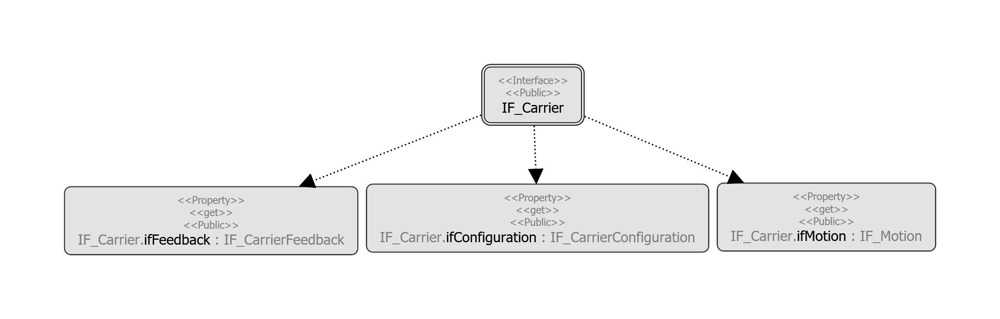

# IF\_Carrier - General Information

## Overview

|  |  |
| --- | --- |
| Type: | Interface |
| Available as of: | V1.0.0.0 |
| Inherits from: | - |

## Task

Interface for controlling a single carrier within the Lexium™ MC multi carrier transport system.

## Description

Each carrier is assigned to a specific IF\_Carrier interface. This interface provides methods and properties for controlling different aspects of a carrier like configuration or move commands.

## Properties

| Name | Data type | Accessing | Description |
| --- | --- | --- | --- |
| ifConfiguration | IF\_CarrierConfiguration | Read | Access to the interface IF\_CarrierConfiguration (see [IF\_CarrierConfiguration](IF_CarrierConfiguration-GeneralInfo-8648EB3B.html#IF_CarrierConfiguration-GeneralInfo-8648EB3B)) for configuring a carrier. |
| ifFeedback | IF\_CarrierFeedback | Read | Access to the interface IF\_CarrierFeedback (see [IF\_CarrierFeedback](CarrFeedb-D6843C20.html#CarrFeedb-D6843C20)) for reading feedback information from the carrier. |
| ifMotion | IF\_Motion | Read | Access to the interface IF\_Motion (see [IF\_Motion](IF_Motion-GeneralInformation-5B7BD260.html#IF_Motion-GeneralInformation-5B7BD260)) for executing the motion methods for a carrier. |
| udiCarrierIndex | UDINT | Read | Indicates the carrier index. |

## Inputs

The interface has no inputs.

## Outputs

The interface has no outputs.

EIO0000004641.10