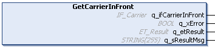

# IF\_Carrier - GetCarrierInFront (Method)

## Overview

|  |  |
| --- | --- |
| Type: | Method |
| Available as of: | V1.0.0.0 |

## Task

Accessing the interface of the carrier in front.

## Description

The method GetCarrierInFront returns the carrier interface IF\_Carrier for the carrier that is positioned in front of the selected carrier on a track.

See also the method [SetCarrierInFront](SetCarrInFront-E0ECE119.html#SetCarrInFront-E0ECE119).

## Inputs

The method has no inputs.

## Outputs

| Output | Data type | Description |
| --- | --- | --- |
| q\_ifCarrierInFront | [IF\_Carrier](IF_Carrier-E050ABF7.html#IF_Carrier-E050ABF7) | Accessing the carrier interface for the carrier that is in front of the selected carrier in the moving direction. |
| q\_xError | BOOL | Indicates TRUE if an error has been detected. For details, refer to q\_etResult and q\_sResultMsg. |
| q\_etResult | [ET\_Result](ET_Result-509D6EF3.html#ET_Result-509D6EF3) | Provides diagnostic and status information as a numeric value. If q\_xError = FALSE, q\_etResult provides status information. If q\_xError = TRUE, q\_etResult provides diagnostic/error information. |
| q\_sResultMsg | STRING [255] | Provides additional diagnostic and status information as a text message. |

EIO0000004641.10