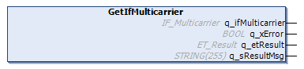

# IF\_Carrier - GetIfMulticarrier (Method)

## Overview

|  |  |
| --- | --- |
| Type: | Method |
| Available as of: | V1.8.4.0 |

## Task

Accessing the parent interface IF\_Multicarrier.

## Description

The method GetIfMulticarrier returns the parent interface IF\_Multicarrier from the carrier.

For more information, refer to [IF\_Multicarrier](IF_Carrier-E04E3FF8.html).

## Inputs

The method has no inputs.

## Outputs

| Output | Data type | Description |
| --- | --- | --- |
| q\_ifMulticarrier | [IF\_Multicarrier](IF_Carrier-E04E3FF8.html) | Accessing the parent interface IF\_Multicarrier from the carrier. |
| q\_xError | BOOL | Indicates TRUE if an error has been detected. For details, refer to q\_etResult and q\_sResultMsg. |
| q\_etResult | [ET\_Result](ET_Result-509D6EF3.html#ET_Result-509D6EF3) | Provides diagnostic and status information as a numeric value. If q\_xError = FALSE, q\_etResult provides status information. If q\_xError = TRUE, q\_etResult provides diagnostic/error information. |
| q\_sResultMsg | STRING [255] | Provides additional diagnostic and status information as a text message. |

EIO0000004641.10