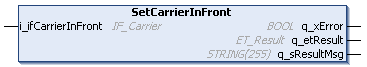
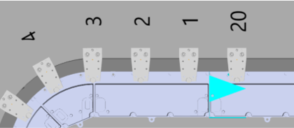

# IF\_Carrier - SetCarrierInFront (Method)

## Overview

|  |  |
| --- | --- |
| Type: | Method |
| Available as of: | V1.0.0.0 |



## Task

Assigning the carrier in front.

## Description

With the method SetCarrierInFront, you can assign the carrier that is positioned in front of the selected carrier on a track.

For more information on the carrier positions, refer to the [general description](IntroMC_MovDir-10BB46E9.html#IntroMC_MovDir-10BB46E9__InFrontBehind-10BB584B) of a Lexium™ MC multi carrier track.

## Example



NOTE: Moving direction of the carriers: from left to right (clockwise).

For assigning the carrier with number 20 as a carrier in front of the selected carrier with number 1, proceed as follows:

```
...ifMulticarrier.raifCarrier[1].SetCarrierInFront(
        i_ifCarrierInFront 	:= ifMulticarrier.raifCarrier[20],
        q_xError					=> xError,
        q_etResult				=> etResult,
        q_sResultMsg				=> sResultMsg);
```

## Inputs

| Input | Data type | Description |
| --- | --- | --- |
| i\_ifCarrierInFront | [IF\_Carrier](IF_Carrier-E050ABF7.html#IF_Carrier-E050ABF7) | The carrier that is in front of the selected carrier in the moving direction. |

## Outputs

| Output | Data type | Description |
| --- | --- | --- |
| q\_xError | BOOL | Indicates TRUE if an error has been detected. For details, refer to q\_etResult and q\_sResultMsg. |
| q\_etResult | [ET\_Result](ET_Result-509D6EF3.html#ET_Result-509D6EF3) | Provides diagnostic and status information as a numeric value. If q\_xError = FALSE, q\_etResult provides status information. If q\_xError = TRUE, q\_etResult provides diagnostic/error information. |
| q\_sResultMsg | STRING [255] | Provides additional diagnostic and status information as a text message. |

EIO0000004641.10