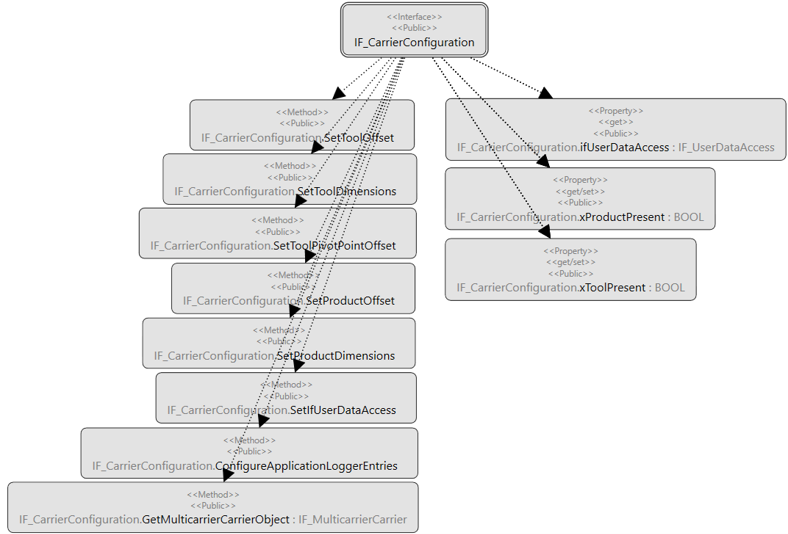

# IF\_CarrierConfiguration - General Information

## Overview

|  |  |
| --- | --- |
| Type: | Interface |
| Available as of: | V1.0.0.0 |
| Inherits from: | - |

## Task

Interface for the configuration of a single carrier within the Lexium™ MC multi carrier transport system.

## Description

The interface provides several methods and properties for configuring a single carrier within the Lexium™ MC multi carrier transport system.

## Properties

| Property | Data type | Accessing | Description |
| --- | --- | --- | --- |
| ifUserDataAccess | IF\_UserDataAccess | Read | Interface to the user-defined function block that has been connected with the method [SetIfUserDataAccess](SetUserData-E49E382C.html#SetUserData-E49E382C)  This property can only be read if the method SetIfUserDataAccess has been called successfully.  See also [IF\_UserDataAccess](UserDataAcc-E4F29A3E.html#UserDataAcc-E4F29A3E). |
| xProductPresent | BOOL | Read/Write | If xProductPresent is set to TRUE, the dimensions of a product defined by the method SetProductDimensions (see [SetProductDimensions](IF_CarrierConfiguration-SetProductD-514499A8.html#IF_CarrierConfiguration-SetProductD-514499A8)) are considered for the properties lrFrontOffset  and lrRearOffset (see [IF\_CarrierFeedbackConfiguration – Properties](CarrFeedbConf-E1D3F75B.html#CarrFeedbConf-E1D3F75B__Properties-E1D40F93)). |
| xToolPresent | BOOL | Read/Write | If xToolPresent is set to TRUE, the dimensions of a tool defined by the method SetToolDimensions (see [SetToolDimensions](IF_CarrierConfiguration-SetToolDime-51BFC8FC.html#IF_CarrierConfiguration-SetToolDime-51BFC8FC)) are considered for the properties lrFrontOffset  and lrRearOffset (see [IF\_CarrierFeedbackConfiguration – Properties](CarrFeedbConf-E1D3F75B.html#CarrFeedbConf-E1D3F75B__Properties-E1D40F93)). |

## Inputs

The interface has no inputs.

## Outputs

The interface has no outputs.

EIO0000004641.10