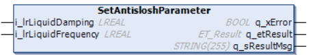

# IF\_CarrierConfiguration - SetAntisloshParameter (Method)

## Overview

|  |  |
| --- | --- |
| Type: | Method |
| Available as of: | V1.3.7.0 |

## Task

Setting the natural damping coefficient and the natural frequency of a homogeneous liquid.

## Description

With the method SetAntisloshParameter, you can define the natural damping coefficient and the natural frequency of a homogeneous liquid. These values serve as the basis for calculating an antislosh motion profile.

NOTE: Modified values are not considered for the running move command but for the next move command.

## Inputs

| Input | Data type | Value range | Unit | Description |
| --- | --- | --- | --- | --- |
| i\_lrLiquidDamping | LREAL | 0 ≤ i\_lrLiquidDamping ≤ 1 | – | Specifies the natural damping coefficient of the liquid. |
| i\_ lrLiquidFrequency | LREAL | i\_ lrLiquidFrequency ≥ 0.0 | Hz | Specifies the natural frequency of the liquid. |

## Outputs

| Output | Data type | Description |
| --- | --- | --- |
| q\_xError | BOOL | Indicates TRUE if an error has been detected. For details, refer to q\_etResult and q\_sResultMsg. |
| q\_etResult | [ET\_Result](ET_Result-509D6EF3.html#ET_Result-509D6EF3) | Provides diagnostic and status information as a numeric value. If q\_xError = FALSE, q\_etResult provides status information. If q\_xError = TRUE, q\_etResult provides diagnostic/error information. |
| q\_sResultMsg | STRING [255] | Provides additional diagnostic and status information as a text message. |

EIO0000004641.10