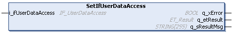
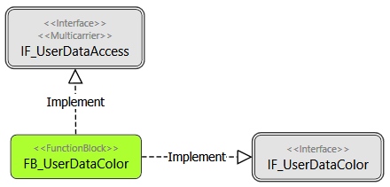
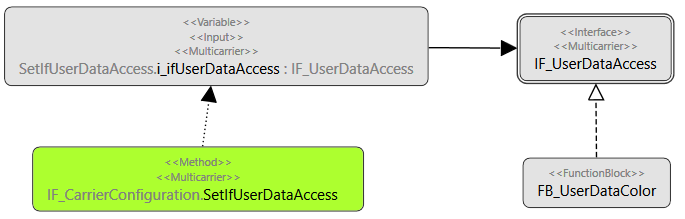
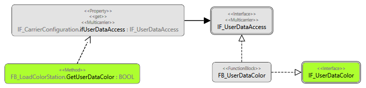

# IF\_CarrierConfiguration - SetIfUserDataAccess (Method)

## Overview

|  |  |
| --- | --- |
| Type: | Method |
| Available as of: | V1.0.0.0 |



## Task

Connecting a user-defined function block to a carrier.

## Description

With the method SetIfUserDataAccess, you can connect your function block to a carrier.

1. Create a function block (for example FB\_UserDataColor) that implements:
   * the interface IF\_UserDataAccess for connecting your function block to the carrier
   * an interface for your specific data (for example IF\_UserDataColor)

   
2. Connect your function block to the carrier with the method SetIfUserDataAccess .

   Code example for assigning the function block FB\_UserDataColor to carrier 1:

   ```
   i_ifMulticarrier.raifCarrier[1].ifConfiguration.SetIfUserDataAccess(
           i_ifUserDataAccess    :=    fbUserDataColor,
           q_xError              =>    xError,
           q_etResult            =>    etResult,
           q_etResultMsg         =>    sResultMsg);
   ```

   
3. In an application function block (for example FB\_LoadColorStation), the user-defined function block (for example FB\_UserDataColor) is now accessible via the property ifUserDataAccess.

   

   Code example:

   ```
   IF i_ifCarrier <> 0
       AND_THEN i_ifCarrier.ifConfiguration.ifUserDataAccess <> 0
       AND_THEN i_ifCarrier.ifConfiguration.ifUserDataAccess.xUserDataAdded
   THEN
       xSuccessGetIfUserData  := _QUERYINTERFACE(i_ifCarrier.ifConfiguration.ifUserDataAccess, ifUserDataColor);
   END_IF
   ```

## Inputs

| Input | Data type | Description |
| --- | --- | --- |
| i\_ifUserDataAccess | IF\_UserDataAccess | Interface that must be implemented in a user-defined function block to connect this function block to the carrier. |

## Outputs

| Output | Data type | Description |
| --- | --- | --- |
| q\_xError | BOOL | Indicates TRUE if an error has been detected. For details, refer to q\_etResult and q\_sResultMsg. |
| q\_etResult | [ET\_Result](ET_Result-509D6EF3.html#ET_Result-509D6EF3) | Provides diagnostic and status information as a numeric value. If q\_xError = FALSE, q\_etResult provides status information. If q\_xError = TRUE, q\_etResult provides diagnostic/error information. |
| q\_sResultMsg | STRING [255] | Provides additional diagnostic and status information as a text message. |

EIO0000004641.10