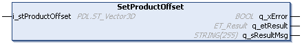

# IF\_CarrierConfiguration - SetProductOffset (Method)

## Overview

|  |  |
| --- | --- |
| Type: | Method |
| Available as of: | V1.0.0.0 |

## Task

Setting the offset vector for the product center point.

## Description

With the method SetProductOffset, you can specify the offset vector from the center point of the carrier to the center point of the product.

NOTE: If you install a tool for transporting a product on your carrier, the center point of the carrier is still the reference point for defining the product offset. (For more information on the tool settings, refer to the methods [SetToolDimensions](IF_CarrierConfiguration-SetToolDime-51BFC8FC.html#IF_CarrierConfiguration-SetToolDime-51BFC8FC) and [SetToolOffset](IF_CarrierConfiguration-SetToolOffs-51C243A4.html#IF_CarrierConfiguration-SetToolOffs-51C243A4).)

| Top view | Side view |
| --- | --- |
|  |  |
| * The crossing red lines indicate the center of the carrier in X and Y direction. * The green box symbolizes the product to be transported by the carrier. | * The red line indicates the height of the carrier in Z direction. * The green box symbolizes the product to be transported by the carrier. |

For more information on the coordinate system of the carrier, refer to [Carrier Coordinate System](IntroMC_CarrCenter-16E8092C.html#IntroMC_CarrCenter-16E8092C__CarrierCoordinateSystem-16E820B3).

The product offset is used for calculating the rear offset and the front offset of the carrier based on the [ToolDimensions](IF_CarrierConfiguration-SetToolDime-51BFC8FC.html#IF_CarrierConfiguration-SetToolDime-51BFC8FC) and the [ToolOffset](IF_CarrierConfiguration-SetToolOffs-51C243A4.html#IF_CarrierConfiguration-SetToolOffs-51C243A4) as well as the [ProductDimensions](IF_CarrierConfiguration-SetProductD-514499A8.html#IF_CarrierConfiguration-SetProductD-514499A8) and the ProductOffset.

For more details on the properties lrRearOffset and lrFrontOffset, refer to the interface [IF\_CarrierFeedbackConfiguration](CarrFeedbConf-E1D3F75B.html#CarrFeedbConf-E1D3F75B).

## Inputs

| Input | Data type | Description |
| --- | --- | --- |
| i\_stProductOffset | [PDL.ST\_Vector3D](../../../../../api/crossBook?lang=en-US&virtualBookName=PD.Lib.PacDriveLib&topicID=D_SE_0087802) | Specifies the center point of the product in relation to the center point of the carrier. |

## Outputs

| Output | Data type | Description |
| --- | --- | --- |
| q\_xError | BOOL | Indicates TRUE if an error has been detected. For details, refer to q\_etResult and q\_sResultMsg. |
| q\_etResult | [ET\_Result](ET_Result-509D6EF3.html#ET_Result-509D6EF3) | Provides diagnostic and status information as a numeric value. If q\_xError = FALSE, q\_etResult provides status information. If q\_xError = TRUE, q\_etResult provides diagnostic/error information. |
| q\_sResultMsg | STRING [255] | Provides additional diagnostic and status information as a text message. |

EIO0000004641.10