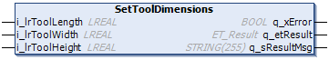

# IF\_CarrierConfiguration - SetToolDimensions (Method)

## Overview

|  |  |
| --- | --- |
| Type: | Method |
| Available as of: | V1.0.0.0 |

## Task

Setting the tool dimensions.

## Description

With the method SetToolDimensions, you can define the length, the width and the height of the tool installed at the carrier.

## Inputs

| Input | Data type | Value range | Unit | Description |
| --- | --- | --- | --- | --- |
| i\_lrToolLength | LREAL | i\_lrToolLength ≥ 0.0 | mm | Specifies the length of the tool. |
| i\_ lrToolWidth | LREAL | i\_ lrToolWidth ≥ 0.0 | mm | Specifies the width of the tool. |
| i\_ lrToolHeight | LREAL | i\_ lrToolHeight ≥ 0.0 | mm | Specifies the height of the tool. |

## Outputs

| Output | Data type | Description |
| --- | --- | --- |
| q\_xError | BOOL | Indicates TRUE if an error has been detected. For details, refer to q\_etResult and q\_sResultMsg. |
| q\_etResult | [ET\_Result](ET_Result-509D6EF3.html#ET_Result-509D6EF3) | Provides diagnostic and status information as a numeric value. If q\_xError = FALSE, q\_etResult provides status information. If q\_xError = TRUE, q\_etResult provides diagnostic/error information. |
| q\_sResultMsg | STRING [255] | Provides additional diagnostic and status information as a text message. |

EIO0000004641.10