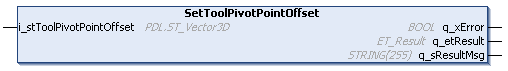
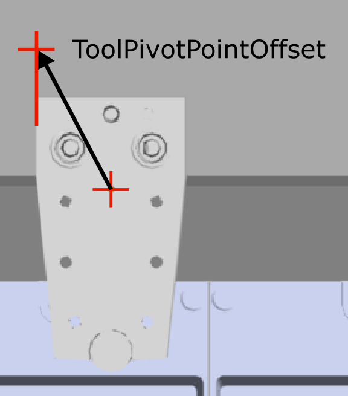

# IF\_CarrierConfiguration - SetToolPivotPointOffset (Method)

## Overview

|  |  |
| --- | --- |
| Type: | Method |
| Available as of: | V1.0.0.0 |

## Task

Setting the offset vector for the ToolPivotPoint.

## Description

With the method SetToolPivotPointOffset, you can specify the offset vector from the center point of the carrier to the ToolPivotPoint. Thus, the ToolPivotPoint is defined by the ToolPivotPointOffset in relation to the center point of the carrier.

NOTE: For the definition of the ToolPivotPointOffset, only the X and Y axes of the 3-D vector are used. The value for the Z axis is 0.

For more information on the coordinate system of the carrier, refer to [Carrier Coordinate System](IntroMC_CarrCenter-16E8092C.html#IntroMC_CarrCenter-16E8092C__CarrierCoordinateSystem-16E820B3).

The ToolPivotPointOffset is used for synchronized movements of carriers with additional curve compensation (see [StartCurveCompensationToCarrierInFront](IF_MoveSyncPathFromStandstill-Start-58861273.html#IF_MoveSyncPathFromStandstill-Start-58861273)).

## Inputs

| Input | Data type | Description |
| --- | --- | --- |
| i\_stToolPivotPointOffset | [PDL.ST\_Vector3D](../../../../../api/crossBook?lang=en-US&virtualBookName=PD.Lib.PacDriveLib&topicID=D_SE_0087802) | Specifies the ToolPivotPoint in relation to the center point of the carrier. |

## Outputs

| Output | Data type | Description |
| --- | --- | --- |
| q\_xError | BOOL | Indicates TRUE if an error has been detected. For details, refer to q\_etResult and q\_sResultMsg. |
| q\_etResult | [ET\_Result](ET_Result-509D6EF3.html#ET_Result-509D6EF3) | Provides diagnostic and status information as a numeric value. If q\_xError = FALSE, q\_etResult provides status information. If q\_xError = TRUE, q\_etResult provides diagnostic/error information. |
| q\_sResultMsg | STRING [255] | Provides additional diagnostic and status information as a text message. |

EIO0000004641.10