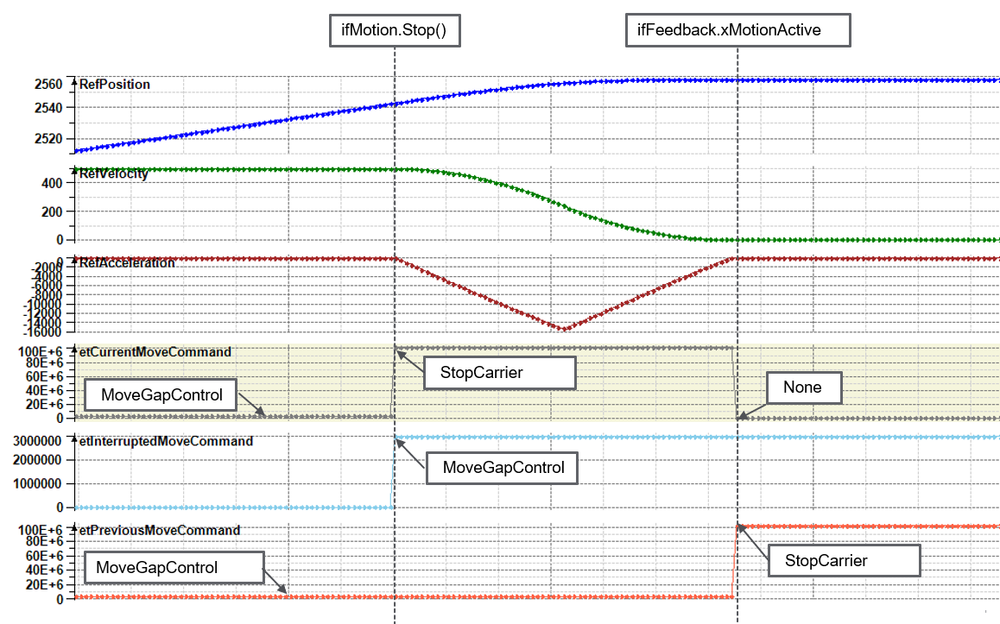
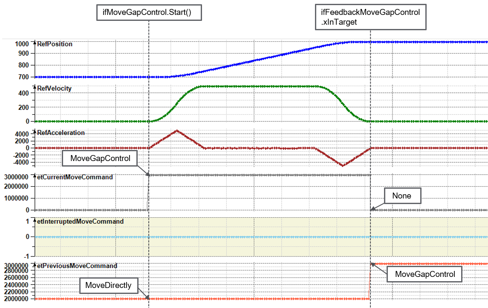

# IF\_CarrierFeedback - General Information

## Overview

|  |  |
| --- | --- |
| Type: | Interface |
| Available as of: | V1.0.0.0 |
| Inherits from: | - |

## Task

Interface with feedback for the carrier.

## Description

The interface provides feedback information from the carrier. This includes feedback for the different positions of the carrier on the path and in space and also feedback for the different move commands.

## Properties

| Property | Data type | Accessing | Description |
| --- | --- | --- | --- |
| etCurrentMoveCommand | ET\_MoveCommand | Read | Indicates the active move command for the carrier. For more information, refer to the enumeration [ET\_MoveCommand](ET_MoveComm-DA370FC4.html#ET_MoveComm-DA370FC4). |
| etInterruptedMoveCommand | ET\_MoveCommand | Read | Indicates the move command that has been interrupted by the method [StopCarrier](IF_MotionStopCarrier-587B0D50.html#IF_MotionStopCarrier-587B0D50) or [StopCarrierWithEmergencyParameter](StopCarrierEmergPara-AF81B4BA.html#StopCarrierEmergPara-AF81B4BA).  For illustration, see the [trace example](#CarrFeedb-D6843C20__InterrupMoveCmd-5B670A6D) for the stop command below. For more information on the move commands available, refer to [ET\_MoveCommand](ET_MoveComm-DA370FC4.html#ET_MoveComm-DA370FC4). |
| etPreviousMoveCommand | ET\_MoveCommand | Read | Indicates the previous move command for the carrier.  For illustration, see the [trace example](#CarrFeedb-D6843C20__PrevMoveCmd-5B6735F3) for the previous move command below. For more information on the move commands available, refer to [ET\_MoveCommand](ET_MoveComm-DA370FC4.html#ET_MoveComm-DA370FC4). |
| ifFeedbackConfiguration | [IF\_CarrierFeedbackConfiguration](CarrFeedbConf-E1D3F75B.html#CarrFeedbConf-E1D3F75B) | Read | Access to the feedback interface IF\_CarrierFeedbackConfiguration that provides status values for the configured parameters for a carrier. |
| ifFeedbackJogging | [IF\_CarrierFeedbackJogging](IF_FeedbackJog-AF7A1B56.html#IF_FeedbackJog-AF7A1B56) | Read | Access to the feedback interface IF\_CarrierFeedbackJogging that provides status values for the manual movement of the carrier in jogging mode. |
| ifFeedbackMotionValues | [IF\_CarrierFeedbackMotionValues](FeedbMotionValues-078B6E50.html#FeedbMotionValues-078B6E50) | Read | Access to the feedback interface IF\_CarrierFeedbackMotionValues that provides status values for the reference motion parameters and the actual motion values of a carrier. |
| ifFeedbackMoveDirectly | [IF\_CarrierFeedbackMoveDirectly](IF_FeedbackMoveDirectly-54C7AC81.html#IF_FeedbackMoveDirectly-54C7AC81) | Read | Access to the feedback interface IF\_CarrierFeedbackMoveDirectly that provides status values for the movement of the carrier with the move command MoveDirectly. |
| ifFeedbackMoveGapControl | [IF\_CarrierFeedbackMoveGapControl](IF_FeedbackMoveGapControl-5488A867.html#IF_FeedbackMoveGapControl-5488A867) | Read | Access to the feedback interface IF\_CarrierFeedbackMoveGapControl that provides status values as well as reference values for the movement of the carrier with the move command MoveGapControl. |
| ifFeedbackMovePureSmg | [IF\_CarrierFeedbackMovePureSmg](IF_FeedbackMovePureSmg-58EB777B.html#IF_FeedbackMovePureSmg-58EB777B) | Read | Access to the feedback interface IF\_CarrierFeedbackMovePureSmg that provides status values for the movement of the carrier with the move command MovePureSmg. |
| ifFeedbackMoveSyncFromStandstill | [IF\_CarrierFeedbackMoveSyncFromStandstill](IF_FeedbackMoveSyncPathFromStandsti-58E5517F.html#IF_FeedbackMoveSyncPathFromStandsti-58E5517F) | Read | Access to the feedback interface IF\_CarrierFeedbackMoveSyncFromStandstill that provides status values for a synchronized movement of the carrier with the move command MoveSyncFromStandstill. |
| ifFeedbackSpace | [IF\_CarrierFeedbackSpace](CarrFeedbSpace-E47A301D.html#CarrFeedbSpace-E47A301D) | Read | Access to the feedback interface IF\_CarrierFeedbackSpace that provides feedback values for the curve acceleration and the position of the carrier in space (in a cartesian coordinate system). |
| ifFeedbackToBehind | [IF\_CarrierFeedbackToBehind](CarrFeedbBeh-E16B8095.html#CarrFeedbBeh-E16B8095) | Read | Access to the feedback interface IF\_CarrierFeedbackToBehind that provides status values from the carrier behind of the selected carrier. |
| ifFeedbackToInFront | [IF\_CarrierFeedbackToInFront](CarrFeedbInFr-E16E425A.html#CarrFeedbInFr-E16E425A) | Read | Access to the feedback interface IF\_CarrierFeedbackToInFront that provides status values from the carrier in front of the selected carrier. |
| lrRefMinGapToCarrierBehind | LREAL | Read | Indicates the value of the reference minimum gap to the carrier behind that has been set with the method [IF\_Motion.SetRefMinGapToCarrierBehind](IF_Motion-SetRefMinGapToCarrierBehi-534E0D23.html#IF_Motion-SetRefMinGapToCarrierBehi-534E0D23). |
| lrRefMinGapToCarrierInFront | LREAL | Read | Indicates the value of the reference minimum gap to the carrier in front that has been set with the method [IF\_Motion.SetRefMinGapToCarrierInFront](IF_Motion-SetRefMinGapToCarrierInFr-6E20C338.html#IF_Motion-SetRefMinGapToCarrierInFr-6E20C338). |
| lrTargetPosition | LREAL | Read | Indicates the target position of the carrier. |
| udiCarrierIndex | UDINT | Read | Indicates the carrier index. |
| udiNumberOfConnectedCarriersBehindThisCarrier | UDINT | Read | Indicates the number of connected (synchronized) carriers behind the selected carrier. |
| udiNumberOfConnectedCarriersInFrontThisCarrier | UDINT | Read | Indicates the number of connected (synchronized) carriers in front of the selected carrier. |
| udiStationId | UDINT | Read | Indicates the number of the station to which the carrier is assigned. |
| xEnabled | BOOL | Read | Indicates TRUE if the parameter Enabled of the carrier object Lexium MC Carrier is TRUE and the function block [FB\_Multicarrier](FB_Multicarrier-GeneralInformation-5134B521.html) is ready for motion commands.  For more information on the carrier object Lexium MC Carrier and the parameter Enabled within the user function CarrierState, refer to the [Lexium™ MC multi carrier Device Objects and Parameters Guide](../../../../../api/crossBook?lang=en-US&virtualBookName=MCRDOaPG&topicID=Enabled_9C690CAD). |
| xGapCompensationActive | BOOL | Read | Indicates TRUE if gap compensation has been activated by the method [IF\_Motion - ActivateGapCompensation](ActivateGapComp-EF24B4E9.html#ActivateGapComp-EF24B4E9). |
| xInTargetPosition | BOOL | Read | Indicates TRUE if the carrier is at the target position. |
| xJobActive | BOOL | Read | Indicates TRUE if a job has been assigned to the carrier and if this job is active. |
| xMotionActive | BOOL | Read | Indicates TRUE if the carrier is moving. |

## Trace Example: Interrupted Move Command

## Trace Example: Previous Move Command

EIO0000004641.10