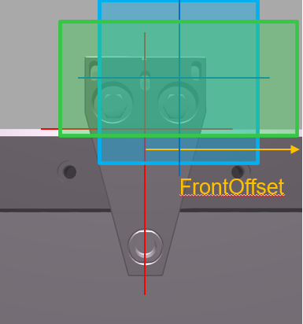
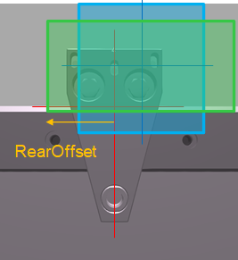

# IF\_CarrierFeedbackConfiguration - General Information

## Overview

|  |  |
| --- | --- |
| Type: | Interface |
| Available as of: | V1.0.0.0 |
| Inherits from: | - |

## Task

Feedback on the configuration of the carrier.

## Description

The feedback interface provides status values for the configured parameters for a carrier.

## Properties

| Property | Data type | Accessing | Description |
| --- | --- | --- | --- |
| lrFrontOffset | LREAL | Read | Indicates the distance from the center point of the carrier to the front edge of the complete unit consisting of carrier, tool and product.  The calculated distance depends on the [ToolDimensions](IF_CarrierConfiguration-SetToolDime-51BFC8FC.html#IF_CarrierConfiguration-SetToolDime-51BFC8FC) and the [ToolOffset](IF_CarrierConfiguration-SetToolOffs-51C243A4.html#IF_CarrierConfiguration-SetToolOffs-51C243A4) as well as the [ProductDimensions](IF_CarrierConfiguration-SetProductD-514499A8.html#IF_CarrierConfiguration-SetProductD-514499A8) and the [ProductOffset](IF_CarrierConfiguration-SetProductO-51C0FECB.html#IF_CarrierConfiguration-SetProductO-51C0FECB).  For illustration, refer to the [Front offset example](CarrFeedbConf-E1D3F75B.html#CarrFeedbConf-E1D3F75B__FrontOffsEx-0C9639F1). |
| lrRearOffset | LREAL | Read | Indicates the distance from the center point of the carrier to the rear edge of the complete unit consisting of carrier, tool and product.  The calculated distance depends on the [ToolDimensions](IF_CarrierConfiguration-SetToolDime-51BFC8FC.html#IF_CarrierConfiguration-SetToolDime-51BFC8FC) and the [ToolOffset](IF_CarrierConfiguration-SetToolOffs-51C243A4.html#IF_CarrierConfiguration-SetToolOffs-51C243A4) as well as the [ProductDimensions](IF_CarrierConfiguration-SetProductD-514499A8.html#IF_CarrierConfiguration-SetProductD-514499A8) and the [ProductOffset](IF_CarrierConfiguration-SetProductO-51C0FECB.html#IF_CarrierConfiguration-SetProductO-51C0FECB).  For illustration, refer to the [Rear offset example](CarrFeedbConf-E1D3F75B.html#CarrFeedbConf-E1D3F75B__RearOffsetExample-E1D414C7). |
| rstCarrierDimensions | REFERENCE TO [ST\_Dimensions](ST_Dimensions-DFCD5317.html#ST_Dimensions-DFCD5317) | Read | Indicates the dimensions of the carrier. The values are taken from the CarrierGeometry parameters of the Lexium MC Carrier object (see [Lexium™ MC multi carrier Device Objects and Parameters Guide](../../../../../api/crossBook?lang=en-US&virtualBookName=MCRDOaPG&topicID=CarrierGeo_B925CC16)). |
| rstProductDimensions | REFERENCE TO [ST\_Dimensions](ST_Dimensions-DFCD5317.html#ST_Dimensions-DFCD5317) | Read | Indicates the dimensions of the configured product. |
| rstProductOffset | REFERENCE TO [PDL.ST\_Vector3D](../../../../../api/crossBook?lang=en-US&virtualBookName=PD.Lib.PacDriveLib&topicID=D_SE_0087802) | Read | Indicates the specified center point of the product in relation to the center point of the carrier.  For more information, refer to the method [SetProductOffset](IF_CarrierConfiguration-SetProductO-51C0FECB.html#IF_CarrierConfiguration-SetProductO-51C0FECB). |
| rstToolDimensions | REFERENCE TO [ST\_Dimensions](ST_Dimensions-DFCD5317.html#ST_Dimensions-DFCD5317) | Read | Indicates the dimensions of the configured tool. |
| rstToolOffset | REFERENCE TO [PDL.ST\_Vector3D](../../../../../api/crossBook?lang=en-US&virtualBookName=PD.Lib.PacDriveLib&topicID=D_SE_0087802) | Read | Indicates the specified center point of the tool in relation to the center point of the carrier.  For more information, refer to the method [SetToolOffset](IF_CarrierConfiguration-SetToolOffs-51C243A4.html#IF_CarrierConfiguration-SetToolOffs-51C243A4). |
| rstToolPivotPointOffset | REFERENCE TO [PDL.ST\_Vector3D](../../../../../api/crossBook?lang=en-US&virtualBookName=PD.Lib.PacDriveLib&topicID=D_SE_0087802) | Read | Indicates the specified ToolPivotPoint in relation to the center point of the carrier.  For more information, refer to the method [SetToolPivotPointOffset](CarrConfigSetPiv-E1EA1065.html#CarrConfigSetPiv-E1EA1065). |
| xApplicationLoggerEntriesActive | BOOL | Read | Indicates TRUE if the carrier writes messages to the Application Logger. |
| xProductPresent | BOOL | Read | Indicates TRUE if a product is present on the carrier. |
| xToolPresent | BOOL | Read | Indicates TRUE if a tool is present on the carrier. |

## Front offset example

FrontOffset (Top view) 

*Conditions:*

* Moving direction of the carrier: from left to right (clockwise)
* Center point of the carrier: red crossing lines
* Tool: blue box
* Product: green box

*Result:*

* FrontOffset: Distance from the center point of the carrier to the front edge of the complete unit consisting of carrier, tool and product

## Rear offset example

RearOffset (Top view) 

*Conditions:*

* Moving direction of the carrier: from left to right (clockwise)
* Center point of the carrier: red crossing lines
* Tool: blue box
* Product: green box

*Result:*

* RearOffset: Distance from the center point of the carrier to the rear edge of the complete unit consisting of carrier, tool and product

EIO0000004641.10