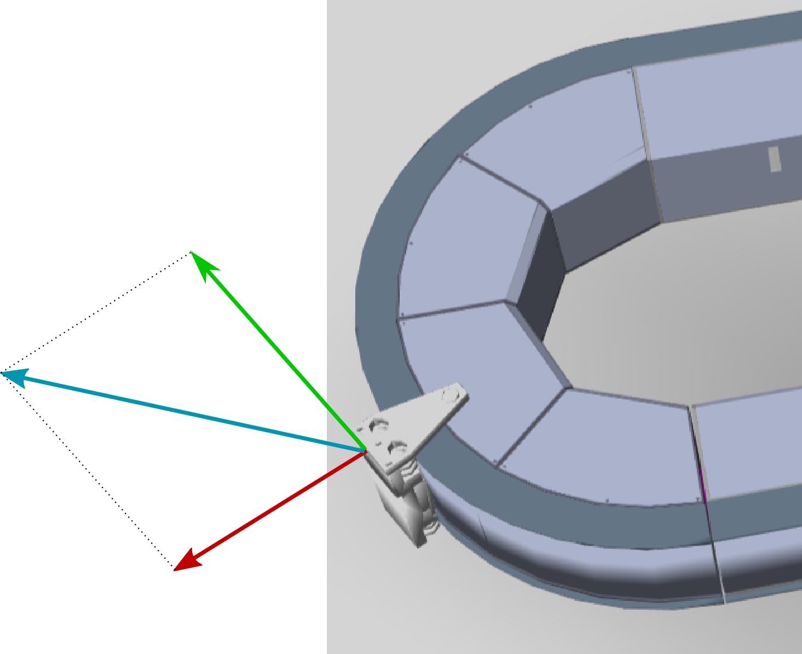
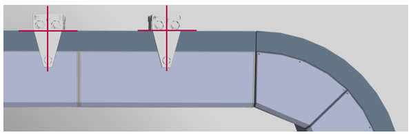
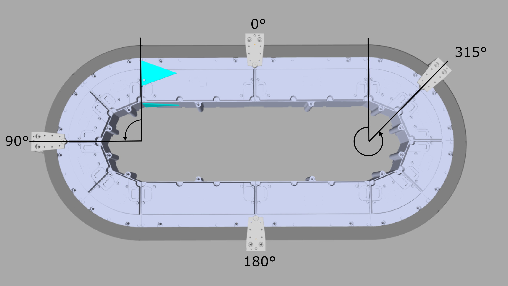

# IF\_CarrierFeedbackSpace - General Information

## Overview

|  |  |
| --- | --- |
| Type: | Interface |
| Available as of: | V1.0.0.0 |
| Inherits from: | - |

## Task

Interface with feedback values for the curve acceleration and the position of the carrier in space (in a cartesian coordinate system).

## Description

A number of parameters determine the position of the carrier in space.

For determining the position of a carrier during curve movements, the following parameters are relevant:

* radial acceleration RefAccelerationRadial: it is calculated for the carrier position on the outside of the guide rails of the track (see [Carrier Center Point](#CarrFeedbSpace-E47A301D__CarrierCenterPoint-16EA81A9))
* path acceleration (tangential acceleration) RefAccelerationTangential
* resultant acceleration RefAccelerationResultant: it is calculated by vector addition of the vectors RefAccelerationRadial and RefAccelerationTangential

Calculation of Resultant Acceleration 

* Green arrow: RefAccelerationTangential
* Red arrow: RefAccelerationRadial
* Blue arrow: RefAccelerationResultant

Carrier Center Point 

Carrier Angle 

## Properties

| Property | Data type | Accessing | Description |
| --- | --- | --- | --- |
| lrAngle | LREAL | Read | Indicates the value of the angle of the carrier (center point) in relation to the origin of the linear coordinate system of the Lexium™ MC multi carrier track (0°).  NOTE: The angle is calculated in mathematical direction, that is counterclockwise.  For more information on the origin of the linear coordinate system, refer to the general description of the [Linear Coordinate System](IntroMC_CoordSys-0FC9FA31.html#IntroMC_CoordSys-0FC9FA31__CoordinateSystem-0FC9F017).  For more information on the carrier center point, refer to the general description of the [Carrier Center Point](IntroMC_CarrCenter-16E8092C.html#IntroMC_CarrCenter-16E8092C). |
| lrRefAccelerationRadial | LREAL | Read | Indicates the calculated radial acceleration. The radial acceleration is calculated as follows: RefAccelerationRadial = lrRefVelocity2 x radius |
| lrRefAccelerationResultant | LREAL | Read | Indicates the resulting acceleration. This value is calculated by vector addition of the parameters RefAccelerationRadial and RefAccelerationTangential. |
| rstCarrierPosition | REFERENCE TO [PDL.ST\_Vector3D](../../../../../api/crossBook?lang=en-US&virtualBookName=PD.Lib.PacDriveLib&topicID=D_SE_0087802) | Read | Indicates the carrier position in cartesian coordinates. |
| rstToolPivotPoint | REFERENCE TO [PDL.ST\_Vector3D](../../../../../api/crossBook?lang=en-US&virtualBookName=PD.Lib.PacDriveLib&topicID=D_SE_0087802) | Read | Indicates the position of the ToolPivotPoint in cartesian coordinates.  The ToolPivotPoint is defined by the ToolPivotPointOffset in relation to the center point of the carrier. For more information on the ToolPivotPoint, refer to the method [SetToolPivotPointOffset](CarrConfigSetPiv-E1EA1065.html#CarrConfigSetPiv-E1EA1065). |

EIO0000004641.10