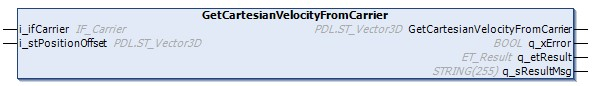
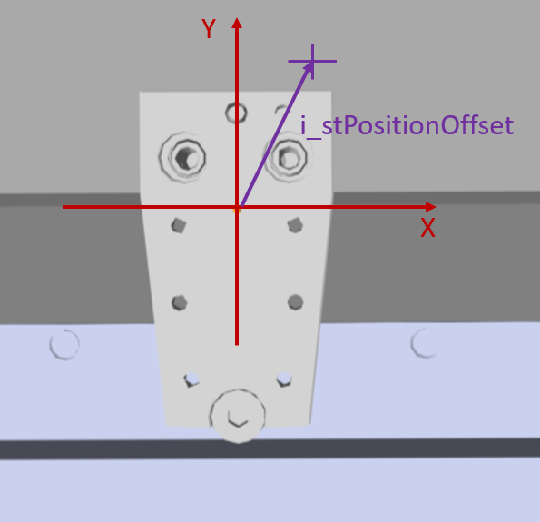
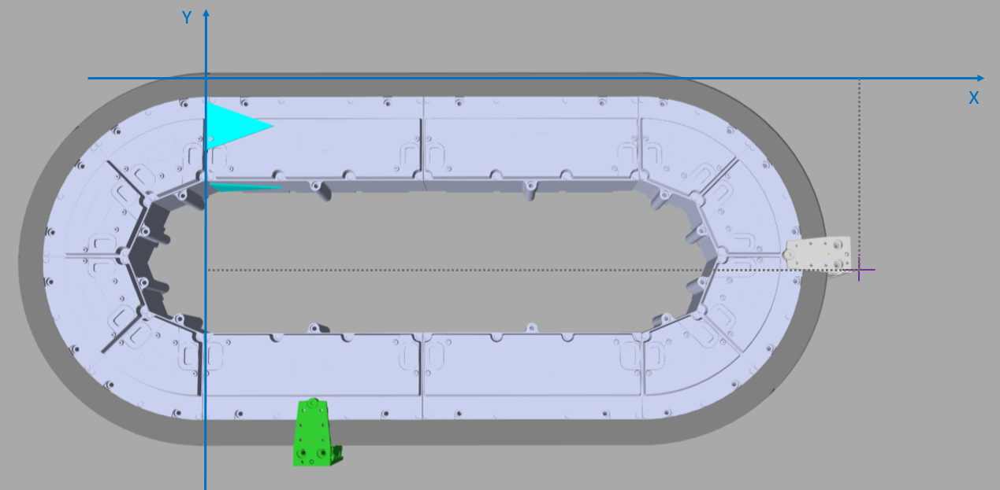

# IF\_CartesianCalculations - GetCartesianVelocityFromCarrier (Method)

## Overview

|  |  |
| --- | --- |
| Type: | Method |
| Available as of: | V1.0.16.0 |

## Task

Calculating the cartesian velocity (X, Y, Z) of a carrier with a given offset vector.

## Description

With the method GetCartesianVelocityFromCarrier, you can calculate the velocity of the carrier in relation to the cartesian coordinate system of the track.

The position offset for the carrier in relation to the physical center point of the carrier (see [Carrier Center Point](IntroMC_CarrCenter-16E8092C.html#IntroMC_CarrCenter-16E8092C)) can be defined by the parameter i\_stPositionOffset. For the calculation of the cartesian velocity of the carrier, this offset is taken into account.

Cartesian Coordinate System of the Carrier 

Cartesian Coordinate System of the Track 

For more information on the cartesian coordinate system of a Lexium™ MC multi carrier track, refer to the description of the [Cartesian Coordinate System of the Track](IntroMC_Cartesian-CB2A38A0.html#IntroMC_Cartesian-CB2A38A0).

The value of the angle of the carrier is indicated by the parameter lrAngle in the interface [IF\_CarrierFeedbackSpace](CarrFeedbSpace-E47A301D.html#CarrFeedbSpace-E47A301D).

## Inputs

| Input | Data type | Description |
| --- | --- | --- |
| i\_ifCarrier | [IF\_Carrier](IF_Carrier-E050ABF7.html#IF_Carrier-E050ABF7) | Accessing the carrier interface. |
| i\_stPositionOffset | [PDL.ST\_Vector3D](../../../../../api/crossBook?lang=en-US&virtualBookName=PD.Lib.PacDriveLib&topicID=D_SE_0087802) | Specifies the position offset in relation to the center point of the carrier. |

## Return value

| Return value | Data type | Description |
| --- | --- | --- |
| GetCartesianVelocityFromCarrier | [PDL.ST\_Vector3D](../../../../../api/crossBook?lang=en-US&virtualBookName=PD.Lib.PacDriveLib&topicID=D_SE_0087802) | Returns the cartesian velocity (X, Y, Z) of carrier in relation to the cartesian coordinate system of the track. |

## Outputs

| Output | Data type | Description |
| --- | --- | --- |
| q\_xError | BOOL | Indicates TRUE if an error has been detected. For details, refer to q\_etResult and q\_sResultMsg. |
| q\_etResult | [ET\_Result](ET_Result-509D6EF3.html#ET_Result-509D6EF3) | Provides diagnostic and status information as a numeric value. If q\_xError = FALSE, q\_etResult provides status information. If q\_xError = TRUE, q\_etResult provides diagnostic/error information. |
| q\_sResultMsg | STRING [255] | Provides additional diagnostic and status information as a text message. |

EIO0000004641.10