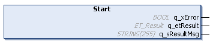

# IF\_Jogging - Start (Method)

## Overview

|  |  |
| --- | --- |
| Type: | Method |
| Available as of: | V1.0.0.0 |

## Task

Starting to manually move the carrier in jogging mode.

## Description

With the method IF\_Jogging - Start, you can start the manual movement of the carrier. For more information on controlling the jogging motions of a carrier, refer to [IF\_Jogging](IF_Jogging-GeneralInformation-57F1DE3C.html#IF_Jogging-GeneralInformation-57F1DE3C).

With the method IF\_Jogging - Start, the movement of the carrier is started without considering other carriers. Take this into account when using this method.

With an open track, the carriers could leave the track at the ends. Therefore, mechanical hard stops must be mounted at both ends of an open track.

| WARNING | |
| --- | --- |
|  | Unintended Equipment OPERATION  Mount mechanical hard stops at both ends of an open track.  Failure to follow these instructions can result in death, serious injury, or equipment damage. |

## Feedbacks

Feedbacks are available in the interface [IF\_CarrierFeedbackJogging](IF_FeedbackJog-AF7A1B56.html#IF_FeedbackJog-AF7A1B56).

## Inputs

The method has no inputs.

## Outputs

| Output | Data type | Description |
| --- | --- | --- |
| q\_xError | BOOL | Indicates TRUE if an error has been detected. For details, refer to q\_etResult and q\_sResultMsg. |
| q\_etResult | [ET\_Result](ET_Result-509D6EF3.html#ET_Result-509D6EF3) | Provides diagnostic and status information as a numeric value. If q\_xError = FALSE, q\_etResult provides status information. If q\_xError = TRUE, q\_etResult provides diagnostic/error information. |
| q\_sResultMsg | STRING [255] | Provides additional diagnostic and status information as a text message. |

EIO0000004641.10