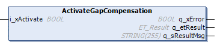
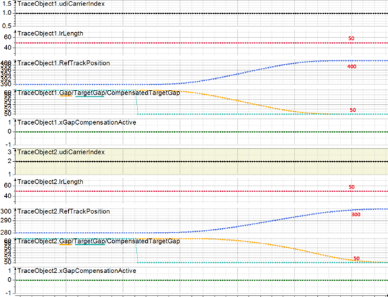
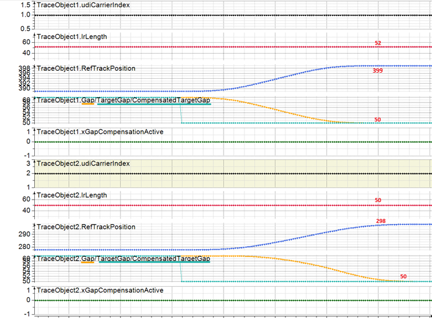
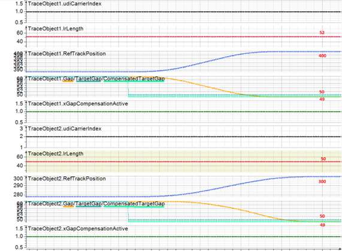

# IF\_Motion - ActivateGapCompensation (Method)

## Overview

|  |  |
| --- | --- |
| Type: | Method |
| Available as of: | V1.8.4.0 |

## Task

Activating or deactivating the gap compensation for the movement of the carrier.

## Description

The method ActivateGapCompensation operates in combination with the move command [MoveGapControl](IF_MoveGapControl-5B81ACFA.html#IF_MoveGapControl-5B81ACFA).

MoveGapControl is used to position carriers by specifying a target gap to the next carrier on the track.

The method ActivateGapCompensation internally adapts the target gap for carriers with different dimensions.

If no gap compensation is active, the gap between two carriers depends on the position and dimensions of the carriers, the tool and/or product dimensions and the tool and/or product offsets. The carrier dimensions are taken from the CarrierGeometry parameters of the Lexium MC Carrier object (see [Lexium™ MC multi carrier Device Objects and Parameters Guide](../../../../../api/crossBook?lang=en-US&virtualBookName=MCRDOaPG&topicID=CarrierGeo_B925CC16)).

When most of the carriers on a track have the same length, you can define their length as the gap compensation reference length (see [SetGapCompensationLength](SetGapCompLength-EF30B6F2.html#SetGapCompLength-EF30B6F2)). With gap compensation, you achieve the same target gap for every carrier, regardless of the configured length of the carrier.

When gap compensation is active (see xGapCompensationActive in the interface [IF\_CarrierFeedback](CarrFeedb-D6843C20.html#CarrFeedb-D6843C20)), the MoveGapControl positioning of a carrier with a different length is the same as the positioning of a carrier with the reference length. The target gap that you have specified for MoveGapControl is internally converted to a compensated target gap (see lrCompensatedTargetGap in the interface [IF\_MoveGapControlParameter](CarrFeedbMoveGapCtrlPara-5B0C6E63.html#CarrFeedbMoveGapCtrlPara-5B0C6E63)).

NOTE: The total compensation takes into account configured length for the selected carrier and the next carrier.

NOTE: The gap compensation does not influence the minimum gaps specified in the interfaces [IF\_Motion – SetRefMinGapToCarrierBehind](IF_Motion-SetRefMinGapToCarrierBehi-534E0D23.html#IF_Motion-SetRefMinGapToCarrierBehi-534E0D23) and [IF\_Motion – SetRefMinGapToCarrierInFront](IF_Motion-SetRefMinGapToCarrierInFr-6E20C338.html#IF_Motion-SetRefMinGapToCarrierInFr-6E20C338). The compensated gap is equal to or greater than the specified RefMinGap.

NOTE: The gap compensation does not compensate tool or product dimensions and offsets.

## Examples

**Example 1:**  For a selected carrier with a configured length of 52 mm without tool or product and a next carrier with a configured length of 50 mm without tool or product, the gap compensation reduces the target gap by 1 mm compared to the target gap specified in the interface IF\_MoveGapControl.

**Example 2:**  For a selected carrier with a configured length of 52 mm, without product and with a tool of 52 mm without offset in combination with a next carrier with a configured length of 50 mm without tool or product, the target gap specified in the interface IF\_MoveGapControl remains unchanged.

## Trace Examples

The trace of two carriers with a length of 50 mm each, moving to a temporary target with a target gap of 50 mm. Their temporary target positions are 400 mm and 300 mm.

The trace of two carriers with a length of 52 mm and 50 mm, moving to a temporary target with a target gap of 50 mm, without gap compensation. Their temporary target positions are 399 mm and 298 mm.

The trace of two carriers with a length of 52 mm and 50 mm, moving to a temporary target with a target gap of 50 mm, with gap compensation. Their temporary target positions are 400 mm and 300 mm.

## Inputs

| Input | Data type | Unit | Description |
| --- | --- | --- | --- |
| i\_xActivate | BOOL | - | If i\_xActivate is TRUE, the gap compensation is activated. |

## Outputs

| Output | Data type | Description |
| --- | --- | --- |
| q\_xError | BOOL | Indicates TRUE if an error has been detected. For details, refer to q\_etResult and q\_sResultMsg. |
| q\_etResult | [ET\_Result](ET_Result-509D6EF3.html#ET_Result-509D6EF3) | Provides diagnostic and status information as a numeric value. If q\_xError = FALSE, q\_etResult provides status information. If q\_xError = TRUE, q\_etResult provides diagnostic/error information. |
| q\_sResultMsg | STRING [255] | Provides additional diagnostic and status information as a text message. |

EIO0000004641.10